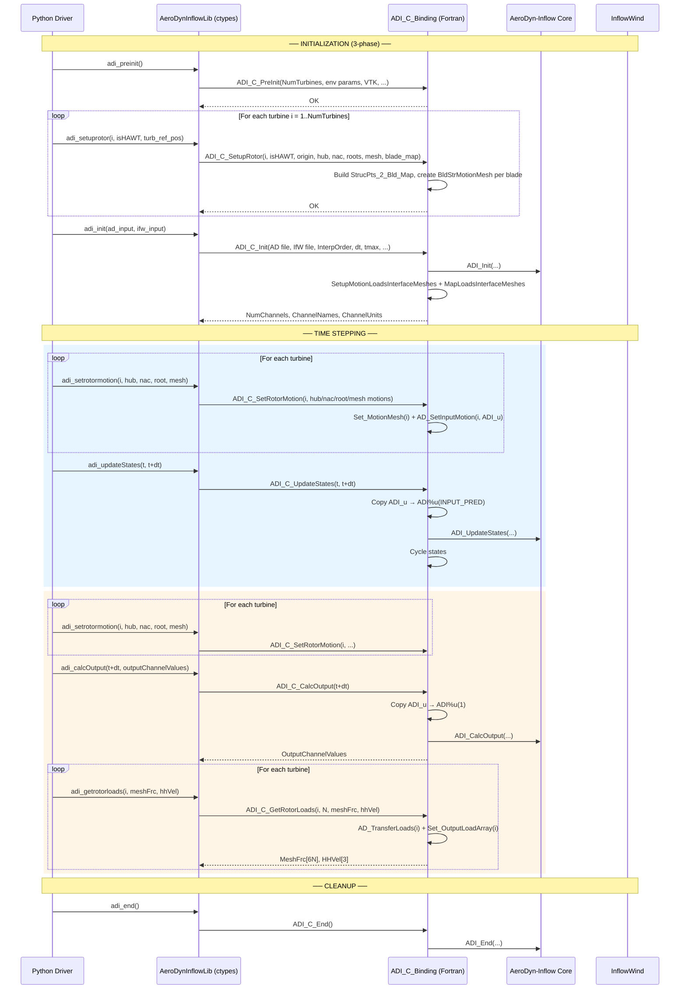
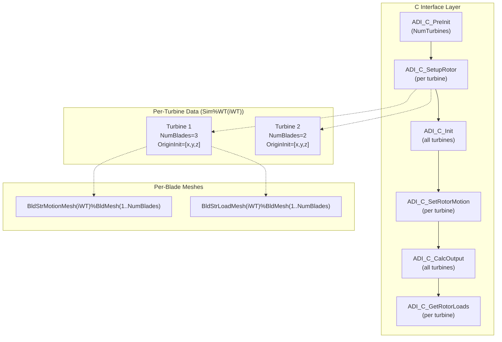
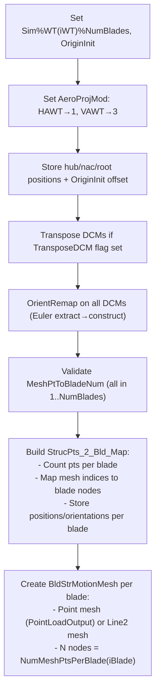
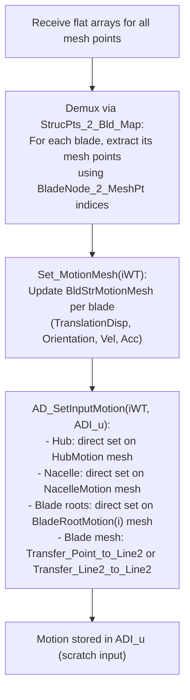
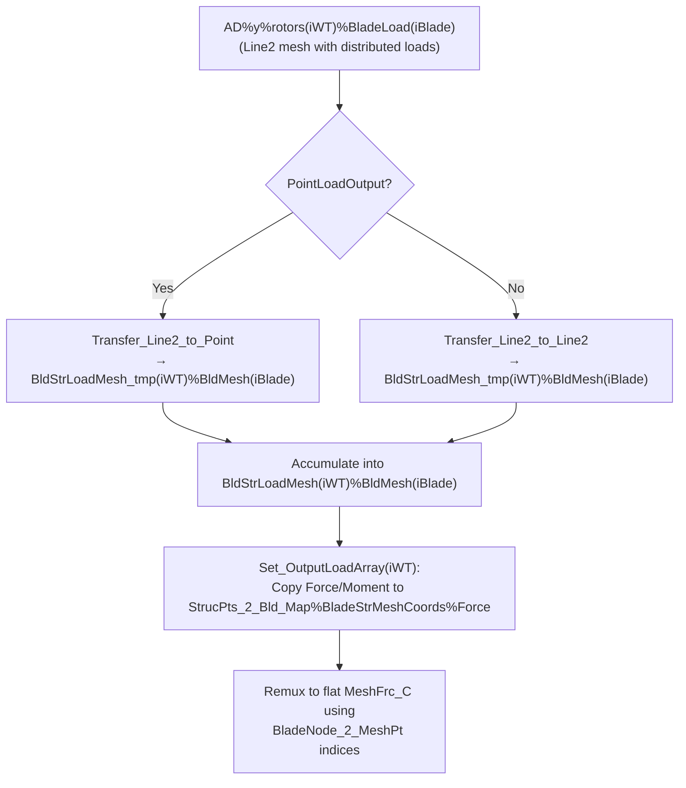

# AeroDyn-Inflow C-Bindings Library Interface — Data Flow Map

> **Generated:** 2026-07-14  
> **Source files analyzed:**
> - [`modules/aerodyn/src/AeroDyn_Inflow_C_Binding.f90`](../../modules/aerodyn/src/AeroDyn_Inflow_C_Binding.f90)
> - [`glue-codes/python/pyOpenFAST/aerodyn_inflow.py`](../../glue-codes/python/pyOpenFAST/aerodyn_inflow.py) (Python wrapper `AeroDynInflowLib`)
> - [`reg_tests/r-test/modules/aerodyn/py_ad_5MW_OC4Semi_WSt_WavesWN/py_ad_driver.py`](../../reg_tests/r-test/modules/aerodyn/py_ad_5MW_OC4Semi_WSt_WavesWN/py_ad_driver.py) — 3-blade HAWT (5MW OC4Semi)
> - [`reg_tests/r-test/modules/aerodyn/py_ad_B1n2_OLAF/py_ad_driver.py`](../../reg_tests/r-test/modules/aerodyn/py_ad_B1n2_OLAF/py_ad_driver.py) — 1-blade VAWT with OLAF free vortex wake

---

## Table of Contents

1. [High-Level Calling Sequence](#1-high-level-calling-sequence)
2. [Architecture: Multi-Rotor and Multi-Blade Design](#2-architecture-multi-rotor-and-multi-blade-design)
3. [Step 1 — `ADI_C_PreInit`](#3-step-1--adi_c_preinit)
4. [Step 2 — `ADI_C_SetupRotor` (per turbine)](#4-step-2--adi_c_setuprotor-per-turbine)
5. [Step 3 — `ADI_C_Init`](#5-step-3--adi_c_init)
6. [Step 4 — `ADI_C_SetRotorMotion` (per turbine, per step)](#6-step-4--adi_c_setrotormotion-per-turbine-per-step)
7. [Step 5 — `ADI_C_UpdateStates`](#7-step-5--adi_c_updatestates)
8. [Step 6 — `ADI_C_CalcOutput`](#8-step-6--adi_c_calcoutput)
9. [Step 7 — `ADI_C_GetRotorLoads` (per turbine)](#9-step-7--adi_c_getrotorloads-per-turbine)
10. [Step 8 — `ADI_C_End`](#10-step-8--adi_c_end)
11. [Mesh Architecture and Blade-Node Mapping](#11-mesh-architecture-and-blade-node-mapping)
12. [Multi-Rotor and Multi-Blade Data Layout](#12-multi-rotor-and-multi-blade-data-layout)
13. [Point Loads vs Distributed Loads](#13-point-loads-vs-distributed-loads)
14. [Comparison of the Two Example Cases](#14-comparison-of-the-two-example-cases)

---

## 1. High-Level Calling Sequence



### Key Architectural Difference from HydroDyn C-Binding

The ADI C-binding uses a **split motion-set / output-get** pattern:
- Motions are set **per rotor** via `SetRotorMotion` 
- `CalcOutput` and `UpdateStates` operate on **all rotors simultaneously** (no per-rotor arguments)
- Loads are retrieved **per rotor** via `GetRotorLoads`

This contrasts with HydroDyn where motions+loads are passed/returned in a single call.

---

## 2. Architecture: Multi-Rotor and Multi-Blade Design



### Supported configurations

| Parameter | Range | Notes |
|-----------|-------|-------|
| `NumTurbines` | 1–9 | Each turbine is independent |
| `NumBlades` per turbine | ≥ 1 | Can differ between turbines |
| `NumMeshPts` per turbine | ≥ 1 | Total structural mesh points across all blades |
| `isHAWT` | 0 or 1 | Sets `AeroProjMod` (1 for HAWT, 3 for VAWT/OLAF) |
| `PointLoadOutput` | true/false | Point loads (N, N·m) vs distributed (N/m, N·m/m) |

---

## 3. Step 1 — `ADI_C_PreInit`

### Purpose
Allocates all turbine-level arrays and sets global environmental/configuration parameters.

### Input Data

| Parameter | C type | Description |
|-----------|--------|-------------|
| `NumTurbines_C` | `c_int` | Number of turbines (1–9) |
| `TransposeDCM_in` | `c_int` | 0/1 flag: transpose DCMs as passed in |
| `PointLoadOutput_in` | `c_int` | 0: distributed loads; 1: point loads |
| `gravity_in` | `c_float` | Gravitational acceleration (m/s²) |
| `defFldDens_in` | `c_float` | Fluid density (kg/m³) |
| `defKinVisc_in` | `c_float` | Kinematic viscosity (m²/s) |
| `defSpdSound_in` | `c_float` | Speed of sound (m/s) |
| `defPatm_in` | `c_float` | Atmospheric pressure (Pa) |
| `defPvap_in` | `c_float` | Vapor pressure (Pa) |
| `WtrDpth_in` | `c_float` | Water depth (m) — MHK only |
| `MSL2SWL_in` | `c_float` | MSL to SWL offset (m) — MHK only |
| `MHK_in` | `c_int` | 0: not MHK, 1: fixed bottom, 2: floating |
| `externFlowField_in` | `c_int` | 0: internal IfW, 1: external (pointer required) |
| `OutVTKDir_C` | `c_char[1025]` | VTK output directory |
| `WrVTK_in` | `c_int` | 0: none, 1: init only, 2: animation |
| `WrVTK_inType` | `c_int` | 1: surface, 2: lines, 3: both |
| `WrVTK_inDT` | `c_double` | VTK output timestep |
| `VTKNacDim_in` | `c_float[6]` | Nacelle dimensions for VTK |
| `VTKHubRad_in` | `c_float` | Hub radius for VTK |
| `DebugLevel_in` | `c_int` | 0–4 debug verbosity |

### What gets allocated

- `Sim%WT(1:NumTurbines)` — per-turbine simulation data
- `InitInp%AD%rotors(1:NumTurbines)` — per-rotor init inputs
- `DiskAvgVelVars(1:NumTurbines)` — disk velocity calculation storage
- `NumMeshPts(1:NumTurbines)` — mesh point counts
- `BldStrMotionMesh(1:NumTurbines)` — motion mesh containers
- `BldStrLoadMesh(1:NumTurbines)` — load mesh containers
- `BldStrLoadMesh_tmp(1:NumTurbines)` — temp load mesh containers
- `StrucPts_2_Bld_Map(1:NumTurbines)` — structural-to-blade mapping

---

## 4. Step 2 — `ADI_C_SetupRotor` (per turbine)

### Purpose
Sets up a single rotor's geometry: blade count, initial hub/nacelle/root positions, structural mesh points, and the mapping of mesh points to blade numbers.

### Input Data

| Parameter | C type | Size | Description |
|-----------|--------|------|-------------|
| `iWT_c` | `c_int` | scalar | Turbine number (1-based) |
| `TurbineIsHAWT_c` | `c_int` | scalar | 1=HAWT, 0=VAWT |
| `TurbOrigin_C` | `c_float` | 3 | Tower base position [x,y,z] — added to all positions |
| `HubPos_C` | `c_float` | 3 | Hub position (relative to origin) |
| `HubOri_C` | `c_double` | 9 | Hub orientation (flattened 3×3 DCM) |
| `NacPos_C` | `c_float` | 3 | Nacelle position (relative to origin) |
| `NacOri_C` | `c_double` | 9 | Nacelle orientation (flattened 3×3 DCM) |
| `NumBlades_C` | `c_int` | scalar | Number of blades on this rotor |
| `BldRootPos_C` | `c_float` | 3×NumBlades | Blade root positions (flat) |
| `BldRootOri_C` | `c_double` | 9×NumBlades | Blade root orientations (flat DCMs) |
| `NumMeshPts_C` | `c_int` | scalar | Total structural mesh points (all blades combined) |
| `InitMeshPos_C` | `c_float` | 3×NumMeshPts | Mesh point positions (flat) |
| `InitMeshOri_C` | `c_double` | 9×NumMeshPts | Mesh point orientations (flat DCMs) |
| `MeshPtToBladeNum_C` | `c_int` | NumMeshPts | Blade number assignment for each mesh point |

### Internal Actions



### The `MeshPtToBladeNum` mapping — critical for multi-blade

This integer array tells the Fortran side which blade each structural mesh point belongs to. For example with 3 blades and 50 nodes on blade 1, 50 on blade 2, 50 on blade 3:

```
MeshPtToBladeNum = [1,1,...,1,  2,2,...,2,  3,3,...,3]
                    ← 50 →      ← 50 →      ← 50 →
```

The Fortran side builds the reverse mapping `BladeNode_2_MeshPt(iBlade)%BladeNodeToMeshPoint(j)` which says "the j-th node on blade iBlade corresponds to mesh point index k in the flat array."

---

## 5. Step 3 — `ADI_C_Init`

### Purpose
Initializes AeroDyn and InflowWind with input files. Creates the internal AD meshes (BladeMotion, HubMotion, etc.) and sets up mesh mappings between the structural interface meshes and the AD internal meshes.

### Input Data

| Parameter | C type | Description |
|-----------|--------|-------------|
| `ADinputFilePassed` | `c_int` | 0: filename, 1: content string |
| `ADinputFileString_C` | `c_char_p` | AeroDyn input file (NULL-delimited) |
| `ADinputFileStringLength_C` | `c_int` | Length of AD input string |
| `IfWinputFilePassed` | `c_int` | 0: filename, 1: content string |
| `IfWinputFileString_C` | `c_char_p` | InflowWind input file (NULL-delimited) |
| `IfWinputFileStringLength_C` | `c_int` | Length of IfW input string |
| `OutRootName_C` | `c_char[1025]` | Root name for output files |
| `InterpOrder_C` | `c_int` | 1 (linear) or 2 (quadratic) |
| `DT_C` | `c_double` | Timestep (s) |
| `TMax_C` | `c_double` | Maximum simulation time (s) |
| `storeHHVel` | `c_int` | Store hub-height velocity from IfW |
| `wrOuts_C` | `c_int` | File output format (0=none, 1=ascii, 2=binary, 3=both) |
| `DT_Outs_C` | `c_double` | Output file timestep |

### Output Data

| Parameter | C type | Description |
|-----------|--------|-------------|
| `NumChannels_C` | `c_int` | Total output channels |
| `OutputChannelNames_C` | `c_char[ChanLen×MaxADIOutputs+1]` | Channel names |
| `OutputChannelUnits_C` | `c_char[ChanLen×MaxADIOutputs+1]` | Channel units |
| `ErrStat_C` | `c_int` | Error status |
| `ErrMsg_C` | `c_char[ErrMsgLen_C]` | Error message |

### Mesh Mapping Created

For each turbine and blade:

| Mapping | Source → Destination | Transfer type |
|---------|---------------------|---------------|
| `Map_BldStrMotion_2_AD_Blade(iBlade,iWT)` | `BldStrMotionMesh(iWT)%BldMesh(iBlade)` → `ADI%u%AD%rotors(iWT)%BladeMotion(iBlade)` | Point→Line2 or Line2→Line2 |
| `Map_AD_BldLoad_P_2_BldStrLoad(iBlade,iWT)` | `ADI%y%AD%rotors(iWT)%BladeLoad(iBlade)` → `BldStrLoadMesh(iWT)%BldMesh(iBlade)` | Line2→Point or Line2→Line2 |

---

## 6. Step 4 — `ADI_C_SetRotorMotion` (per turbine, per step)

### Purpose
Sets the complete kinematic state (position, orientation, velocity, acceleration) of hub, nacelle, blade roots, and structural mesh nodes for one turbine. Must be called **before** `CalcOutput` or `UpdateStates`.

### Input Data

| Parameter | C type | Size | Description |
|-----------|--------|------|-------------|
| `iWT_c` | `c_int` | scalar | Turbine number |
| **Hub** | | | |
| `HubPos_C` | `c_float` | 3 | Position [x,y,z] |
| `HubOri_C` | `c_double` | 9 | Orientation (flattened DCM) |
| `HubVel_C` | `c_float` | 6 | Velocity [TVx,TVy,TVz,RVx,RVy,RVz] |
| `HubAcc_C` | `c_float` | 6 | Acceleration [TAx,TAy,TAz,RAx,RAy,RAz] |
| **Nacelle** | | | |
| `NacPos_C` | `c_float` | 3 | Position [x,y,z] |
| `NacOri_C` | `c_double` | 9 | Orientation (flattened DCM) |
| `NacVel_C` | `c_float` | 6 | Velocity |
| `NacAcc_C` | `c_float` | 6 | Acceleration |
| **Blade Roots** | | | |
| `BldRootPos_C` | `c_float` | 3×NumBlades | Positions (flat) |
| `BldRootOri_C` | `c_double` | 9×NumBlades | Orientations (flat DCMs) |
| `BldRootVel_C` | `c_float` | 6×NumBlades | Velocities (flat) |
| `BldRootAcc_C` | `c_float` | 6×NumBlades | Accelerations (flat) |
| **Structural Mesh** | | | |
| `NumMeshPts_C` | `c_int` | scalar | Total mesh points (must match init) |
| `MeshPos_C` | `c_float` | 3×NumMeshPts | Positions (flat) |
| `MeshOri_C` | `c_double` | 9×NumMeshPts | Orientations (flat DCMs) |
| `MeshVel_C` | `c_float` | 6×NumMeshPts | Velocities (flat) |
| `MeshAcc_C` | `c_float` | 6×NumMeshPts | Accelerations (flat) |

### Internal Data Flow



### Orientation convention

- Orientations are **Direction Cosine Matrices (DCM)** passed as flattened 9-element arrays (row-major from caller)
- If `TransposeDCM=1`, the Fortran side transposes them before use (accounts for row-major vs column-major difference)
- An `OrientRemap` step (Euler extract → Euler construct) corrects minor numerical drift in passed DCMs

---

## 7. Step 5 — `ADI_C_UpdateStates`

### Input Data

| Parameter | C type | Description |
|-----------|--------|-------------|
| `Time_C` | `c_double` | Current time T (s) |
| `TimeNext_C` | `c_double` | Next time T+dt (s) |

### No motion/force data passed

Motions are already stored in `ADI_u` from prior `SetRotorMotion` calls. The `UpdateStates` routine:
1. Detects correction steps (same logic as HydroDyn)
2. Copies `ADI_u` → `ADI%u(INPUT_PRED)`
3. Calls `ADI_UpdateStates`
4. Cycles states: CURR→LAST, PRED→CURR

---

## 8. Step 6 — `ADI_C_CalcOutput`

### Input Data

| Parameter | C type | Description |
|-----------|--------|-------------|
| `Time_C` | `c_double` | Time for output calculation |

### Output Data

| Parameter | C type | Size | Description |
|-----------|--------|------|-------------|
| `OutputChannelValues_C` | `c_float` | `ADI%p%NumOuts` | All output channel values |

### Internal steps
1. Copy `ADI_u` → `ADI%u(1)` (latest motions)
2. Call `ADI_CalcOutput` (computes aerodynamic forces for all rotors)
3. Write VTK if requested
4. Write output file if requested

---

## 9. Step 7 — `ADI_C_GetRotorLoads` (per turbine)

### Input Data

| Parameter | C type | Description |
|-----------|--------|-------------|
| `iWT_C` | `c_int` | Turbine number |
| `NumMeshPts_C` | `c_int` | Must match init value |

### Output Data

| Parameter | C type | Size | Description |
|-----------|--------|------|-------------|
| `MeshFrc_C` | `c_float` | 6×NumMeshPts | Forces/moments at each structural mesh point |
| `HHVel_C` | `c_float` | 3 | Hub-height wind velocity [Vx,Vy,Vz] |

### Internal Load Transfer



The load array is packed back into the **same order** as the input mesh array, using the `BladeNode_2_MeshPt` reverse mapping.

---

## 10. Step 8 — `ADI_C_End`

Cleanup sequence:
1. Finalize output files (close text, write binary)
2. `ADI_End(...)` — destroys primary data
3. Destroy extra `u` instances
4. `ADI_DestroyData(ADI, ...)` — destroys all ADI data
5. `ClearTmpStorage()` — destroys all interface meshes and mappings

---

## 11. Mesh Architecture and Blade-Node Mapping

```mermaid
graph LR
    subgraph "C Interface (flat arrays)"
        FlatIn["MeshPos/Ori/Vel/Acc<br/>[3/9/6/6] × NumMeshPts<br/>(all blades concatenated)"]
        FlatOut["MeshFrc<br/>[6] × NumMeshPts<br/>(all blades concatenated)"]
    end

    subgraph "Blade-Node Demux (StrucPts_2_Bld_Map)"
        Map["MeshPtToBladeNum[k] → blade<br/>BladeNode_2_MeshPt[blade][j] → k"]
    end

    subgraph "Per-Blade Motion Meshes"
        BM1["BldStrMotionMesh(iWT)%BldMesh(1)<br/>N₁ nodes"]
        BM2["BldStrMotionMesh(iWT)%BldMesh(2)<br/>N₂ nodes"]
        BM3["BldStrMotionMesh(iWT)%BldMesh(3)<br/>N₃ nodes"]
    end

    subgraph "AD Internal Meshes"
        AD1["BladeMotion(1)<br/>Line2 mesh (NumBlNds)"]
        AD2["BladeMotion(2)<br/>Line2 mesh (NumBlNds)"]
        AD3["BladeMotion(3)<br/>Line2 mesh (NumBlNds)"]
    end

    subgraph "AD Output Meshes"
        ADL1["BladeLoad(1)<br/>Line2 mesh"]
        ADL2["BladeLoad(2)<br/>Line2 mesh"]
        ADL3["BladeLoad(3)<br/>Line2 mesh"]
    end

    subgraph "Per-Blade Load Meshes"
        LM1["BldStrLoadMesh(iWT)%BldMesh(1)"]
        LM2["BldStrLoadMesh(iWT)%BldMesh(2)"]
        LM3["BldStrLoadMesh(iWT)%BldMesh(3)"]
    end

    FlatIn -->|demux| Map
    Map --> BM1
    Map --> BM2
    Map --> BM3

    BM1 -->|"Map_BldStrMotion_2_AD_Blade(1,iWT)"| AD1
    BM2 -->|"Map_BldStrMotion_2_AD_Blade(2,iWT)"| AD2
    BM3 -->|"Map_BldStrMotion_2_AD_Blade(3,iWT)"| AD3

    ADL1 -->|"Map_AD_BldLoad_P_2_BldStrLoad(1,iWT)"| LM1
    ADL2 -->|"Map_AD_BldLoad_P_2_BldStrLoad(2,iWT)"| LM2
    ADL3 -->|"Map_AD_BldLoad_P_2_BldStrLoad(3,iWT)"| LM3

    LM1 -->|remux| FlatOut
    LM2 -->|remux| FlatOut
    LM3 -->|remux| FlatOut

    style FlatIn fill:#f9f,stroke:#333
    style FlatOut fill:#bfb,stroke:#333
```



### Key data types

| Type | Description |
|------|-------------|
| `MeshByBladeType` | Container holding `BldMesh(:)` — one mesh per blade |
| `StrucPtsToBladeMapType` | Contains `NumMeshPtsPerBlade(:)`, `MeshPt_2_BladeNum(:)`, `BladeNode_2_MeshPt(:)%BladeNodeToMeshPoint(:)`, `BladeStrMeshCoords(:)` |
| `BladeStrMeshCoords` | Per-blade storage of Position(3,N), Orient(3,3,N), Velocity(6,N), Accln(6,N), Force(6,N) |

---

## 12. Multi-Rotor and Multi-Blade Data Layout

### 12.1 Flat array layout for mesh points (all blades concatenated)

For 3 blades with N₁, N₂, N₃ nodes respectively:

```
Position array (3 × NumMeshPts):
[x₁,y₁,z₁, x₂,y₂,z₂, ..., x_N₁,y_N₁,z_N₁,   ← Blade 1
 x₁,y₁,z₁, x₂,y₂,z₂, ..., x_N₂,y_N₂,z_N₂,   ← Blade 2  
 x₁,y₁,z₁, x₂,y₂,z₂, ..., x_N₃,y_N₃,z_N₃]   ← Blade 3

Orientation array (9 × NumMeshPts):
[r11,r12,r13,r21,r22,r23,r31,r32,r33, ...]  ← flattened DCM per point

Velocity/Acceleration array (6 × NumMeshPts):
[TVx,TVy,TVz,RVx,RVy,RVz, ...]  ← per point
```

### 12.2 Blade root arrays

```
BldRootPos (3 × NumBlades):
[x₁,y₁,z₁, x₂,y₂,z₂, x₃,y₃,z₃]

BldRootOri (9 × NumBlades):
[DCM₁(9), DCM₂(9), DCM₃(9)]

BldRootVel (6 × NumBlades):
[TVx₁,TVy₁,TVz₁,RVx₁,RVy₁,RVz₁, ...]
```

### 12.3 Multi-turbine handling

Each turbine is handled independently:
- `SetupRotor` called separately for each turbine with its own geometry
- `SetRotorMotion` called separately for each turbine each timestep
- `GetRotorLoads` called separately for each turbine after `CalcOutput`
- Different turbines can have different numbers of blades and mesh points
- All positions are **relative to `TurbOrigin_C`** — the Fortran side adds the offset

---

## 13. Point Loads vs Distributed Loads

The `PointLoadOutput` flag (set in `PreInit`) controls both the mesh topology and load transfer:

| Setting | Mesh type | Motion transfer | Load transfer | Units returned |
|---------|-----------|-----------------|---------------|----------------|
| `PointLoadOutput=true` | Point elements | `Transfer_Point_to_Line2` | `Transfer_Line2_to_Point` | N, N·m |
| `PointLoadOutput=false` | Line2 elements | `Transfer_Line2_to_Line2` | `Transfer_Line2_to_Line2` | N/m, N·m/m |

With point loads:
- Each structural mesh point is an independent point element
- Forces are lumped at each point (integrated from the AD Line2 output mesh)
- Moments include the effect of distributed loads mapped to the point

With distributed loads:
- Structural mesh points form a Line2 mesh (connected by line elements)
- Forces/moments are per unit length
- Requires at least 2 nodes per blade for the Line2 mesh to be valid

---

## 14. Comparison of the Two Example Cases

| Feature | `py_ad_5MW_OC4Semi_WSt_WavesWN` | `py_ad_B1n2_OLAF` |
|---------|--------------------------------|-------------------|
| Turbine type | HAWT (`is_hawt=1`) | VAWT (`is_hawt=0`) |
| Number of blades | 3 | 1 |
| AeroProjMod | 1 (BEM, NoSweepPitchTwist) | 3 (LiftingLine / OLAF) |
| Aero model | BEM | Free vortex wake (OLAF) |
| Mesh nodes per blade | ~50 (from ED_BladeLn2Mesh) | 2 (minimal) |
| Total NumMeshPts | ~150 | 2 |
| Time steps | 4 | 59 |
| Interpolation order | 2 (quadratic) | 2 (quadratic) |
| VTK output | Yes (surface+lines) | No |
| Correction steps | 0 | 0 |
| Motion source | VTK files from OpenFAST run | VTK files (simple rotation) |
| `PointLoadOutput` | true (default) | true (default) |

### Multi-blade data flow in `py_ad_5MW_OC4Semi`:

```python
# Mesh points concatenated across 3 blades
init_mesh_pos = np.concatenate([blade1_pos, blade2_pos, blade3_pos])  # shape: (150, 3)
init_mesh_pt_to_blade_num = [1]*50 + [2]*50 + [3]*50  # which blade each belongs to
```

### Single-blade data flow in `py_ad_B1n2_OLAF`:

```python
# Only 1 blade with 2 nodes
init_mesh_pos = blade1_pos  # shape: (2, 3)
init_mesh_pt_to_blade_num = [1, 1]  # both nodes on blade 1
```

---

## 15. Summary: Multi-Rotor / Multi-Blade Key Points

1. **Blade assignment is explicit** — the caller provides `MeshPtToBladeNum` telling the Fortran side which blade each mesh point belongs to. This is unlike HydroDyn where mesh mapping uses geometric proximity.

2. **Blade ordering in the flat array is arbitrary** — points don't need to be grouped by blade (though the examples do group them). The `BladeNode_2_MeshPt` mapping handles any ordering.

3. **However, point ordering within a blade matters** — nodes on a given blade should be ordered root-to-tip. This determines the Line2 element connectivity when `PointLoadOutput=false`.

4. **Hub, nacelle, and roots are passed separately from the structural mesh** — they are set directly on the AD internal meshes without mesh mapping. Only the blade structural mesh goes through `Transfer_Point_to_Line2` or `Transfer_Line2_to_Line2`.

5. **Number of structural mesh points need not match AD blade nodes** — the mesh mapping interpolates. You can have 10 structural points mapped to 50 AD nodes, or vice versa.

6. **Each turbine is fully independent** — different turbines can have different blade counts, mesh resolutions, and even turbine types (HAWT vs VAWT), as long as `AeroProjMod` is consistent across all turbines (checked at Init).

7. **The `TurbOrigin` offset is applied inside Fortran** — all positions passed through the interface are relative to the turbine origin. The C-binding adds `Sim%WT(iWT)%OriginInit` before setting them on AD meshes. This simplifies multi-turbine farms where each turbine has a different base location.

8. **Correction steps work identically to HydroDyn** — `UpdateStates` detects repeated calls at the same time and rolls back states automatically.
