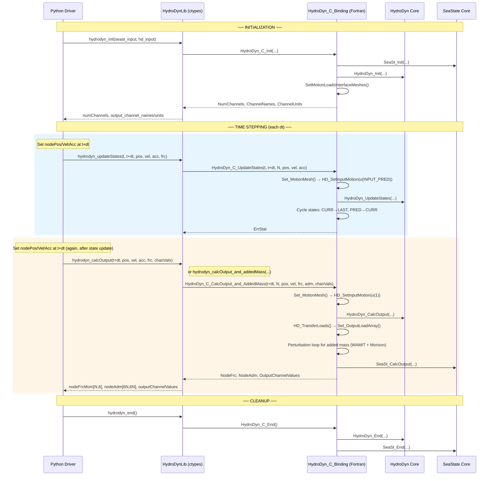
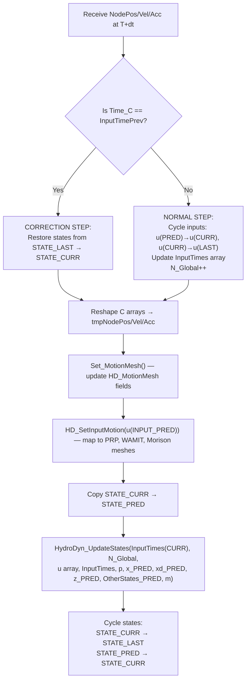
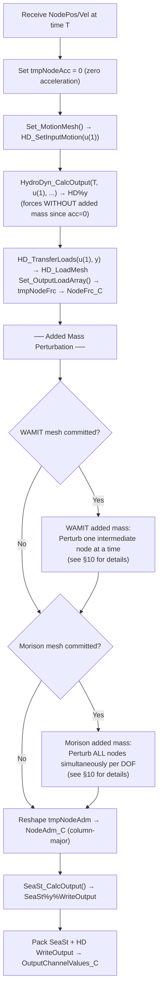
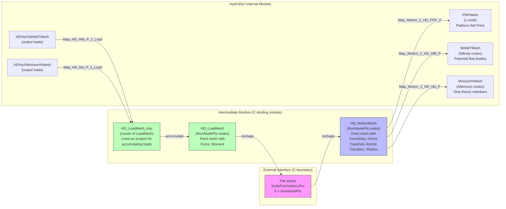
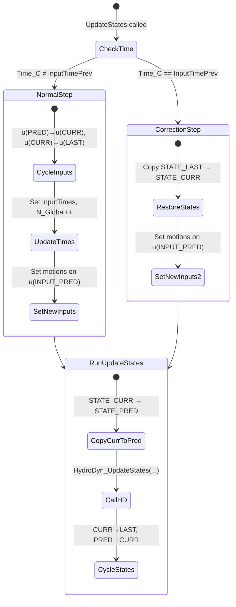
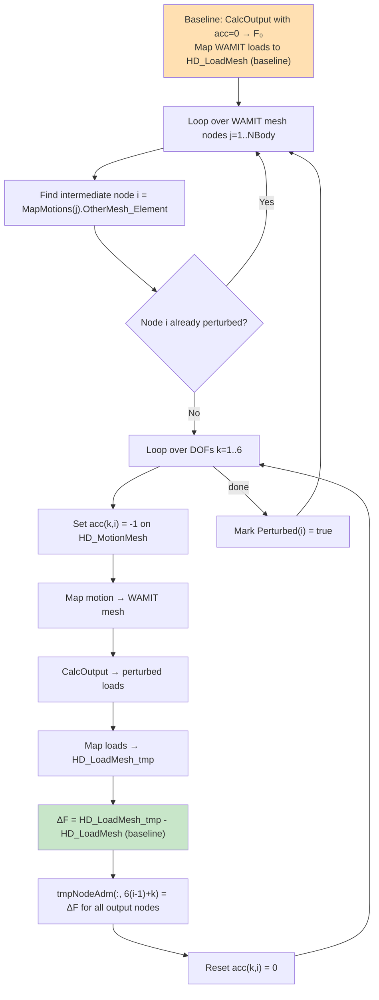
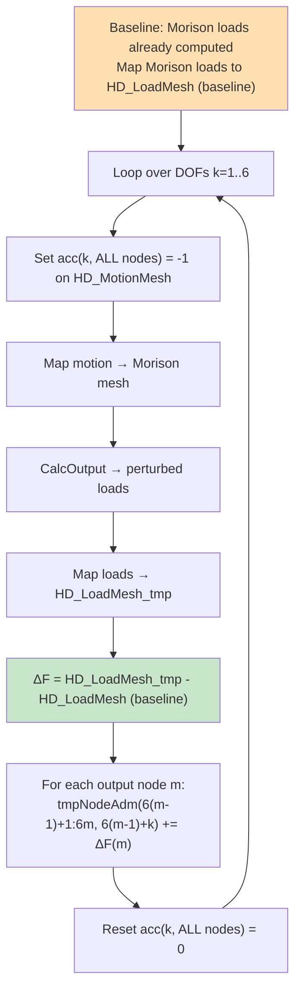

# HydroDyn C-Bindings Library Interface — Data Flow Map

> **Generated:** 2026-07-14  
> **Source files analyzed:**
> - [`modules/hydrodyn/src/HydroDyn_C_Binding.f90`](../modules/hydrodyn/src/HydroDyn_C_Binding.f90)
> - [`glue-codes/python/pyOpenFAST/hydrodyn.py`](../glue-codes/python/pyOpenFAST/hydrodyn.py) (Python wrapper `HydroDynLib`)
> - [`reg_tests/r-test/modules/hydrodyn/py_hd_5MW_OC4Semi_WSt_WavesWN/hydrodyn_driver.py`](../reg_tests/r-test/modules/hydrodyn/py_hd_5MW_OC4Semi_WSt_WavesWN/hydrodyn_driver.py) (Example driver)
>
> **Scope:** `HydroDyn_C_Init`, `HydroDyn_C_UpdateStates`, `HydroDyn_C_CalcOutput_and_AddedMass`, `HydroDyn_C_End`.  
> `HydroDyn_C_CalcOutput` is **excluded** per request (but noted where relevant for comparison).

---

## Table of Contents

1. [High-Level Calling Sequence](#1-high-level-calling-sequence)
2. [Node Convention & Multi-Node Implications](#2-node-convention--multi-node-implications)
3. [Step 1 — `HydroDyn_C_Init`](#3-step-1--hydrodyn_c_init)
4. [Step 2 — `HydroDyn_C_UpdateStates`](#4-step-2--hydrodyn_c_updatestates)
5. [Step 3 — `HydroDyn_C_CalcOutput_and_AddedMass`](#5-step-3--hydrodyn_c_calcoutput_and_addedmass)
6. [Step 4 — `HydroDyn_C_End`](#6-step-4--hydrodyn_c_end)
7. [Internal Mesh Architecture](#7-internal-mesh-architecture)
8. [Multi-Node Data Layout Details](#8-multi-node-data-layout-details)
9. [Correction-Step Logic](#9-correction-step-logic)
10. [Added-Mass Perturbation Strategy](#10-added-mass-perturbation-strategy)

---

## 1. High-Level Calling Sequence



---

## 2. Node Convention & Multi-Node Implications

The C-binding interface uses **`NumNodePts`** external nodes, each carrying 6 DOFs `[x, y, z, Rx, Ry, Rz]`.

| Scenario | `NumNodePts` | Physical meaning |
|----------|:---:|---|
| Rigid floating body | 1 | Single platform reference point; all HD internal nodes (WAMIT body, Morison members) are driven by rigid-body mapping from this one point |
| Flexible / multi-body | N > 1 | Multiple attachment points along substructure; mesh mapping distributes motions to nearest HD nodes |

### Key implication: flat-array sizing scales with N

| Array | Direction | Size | Description |
|-------|-----------|------|-------------|
| `NodePos` | IN | `6 × N` | Positions + Euler angles |
| `NodeVel` | IN | `6 × N` | Translational + rotational velocities |
| `NodeAcc` | IN | `6 × N` | Translational + rotational accelerations |
| `NodeFrc` | OUT | `6 × N` | Forces + moments |
| `NodeAdm` | OUT | `(6N) × (6N)` | Full added-mass matrix (column-major) |

All arrays are **flat** (1-D) across the C interface, packed node-by-node:
```
[x₁,y₁,z₁,Rx₁,Ry₁,Rz₁,  x₂,y₂,z₂,Rx₂,Ry₂,Rz₂,  ...]
```

> **Current Python-side limitation:** `hydrodyn.py` enforces `numNodePts == 1` and raises an exception otherwise (see `hydrodyn_init`). The Fortran side, however, is architecturally ready for N > 1.

---

## 3. Step 1 — `HydroDyn_C_Init`

### 3.1 Signature

```fortran
SUBROUTINE HydroDyn_C_Init( &
    SeaSt_InputFilePassed,  SeaSt_InputFileString_C,  SeaSt_InputFileStringLength_C, &
    HD_InputFilePassed,     HD_InputFileString_C,     HD_InputFileStringLength_C,    &
    OutRootName_C,                                                                   &
    Gravity_C, defWtrDens_C, defWtrDpth_C, defMSL2SWL_C,                             &
    PtfmRefPtPositionX_C, PtfmRefPtPositionY_C,                                      &
    NumNodePts_C, InitNodePositions_C,                                                &
    InterpOrder_C, T_initial_C, DT_C, TMax_C,                                        &
    NumChannels_C, OutputChannelNames_C, OutputChannelUnits_C,                        &
    ErrStat_C, ErrMsg_C )
```

### 3.2 Input Data Table

| Parameter | C type | Fortran type | Description |
|-----------|--------|-------------|-------------|
| `SeaSt_InputFilePassed` | `c_int` | `integer` | 0 = filename, 1 = file content as string |
| `SeaSt_InputFileString_C` | `c_char_p` | `c_ptr` | SeaState input file (NULL-delimited lines) |
| `SeaSt_InputFileStringLength_C` | `c_int` | `integer` | Length of above string |
| `HD_InputFilePassed` | `c_int` | `integer` | 0 = filename, 1 = file content as string |
| `HD_InputFileString_C` | `c_char_p` | `c_ptr` | HydroDyn input file (NULL-delimited lines) |
| `HD_InputFileStringLength_C` | `c_int` | `integer` | Length of above string |
| `OutRootName_C` | `c_char[1025]` | `character` | Root name for echo/output files |
| `Gravity_C` | `c_float` | `real(ReKi)` | Gravitational acceleration (m/s²) |
| `defWtrDens_C` | `c_float` | `real(ReKi)` | Default water density (kg/m³) |
| `defWtrDpth_C` | `c_float` | `real(ReKi)` | Default water depth (m) |
| `defMSL2SWL_C` | `c_float` | `real(ReKi)` | MSL to SWL offset (m, positive up) |
| `PtfmRefPtPositionX_C` | `c_float` | `real(ReKi)` | Platform reference X in wave field |
| `PtfmRefPtPositionY_C` | `c_float` | `real(ReKi)` | Platform reference Y in wave field |
| `NumNodePts_C` | `c_int` | `integer` | Number of external interface nodes (≥ 1) |
| `InitNodePositions_C` | `c_float[6N]` | `real(ReKi)` | Initial node positions `[x,y,z,Rx,Ry,Rz]` × N |
| `InterpOrder_C` | `c_int` | `integer` | Interpolation order: 1 (linear) or 2 (quadratic) |
| `T_initial_C` | `c_double` | `real(DbKi)` | Simulation start time (s) |
| `DT_C` | `c_double` | `real(DbKi)` | Time step (s) |
| `TMax_C` | `c_double` | `real(DbKi)` | Max simulation time (s) — sets wave kinematics array size |

### 3.3 Output Data Table

| Parameter | C type | Description |
|-----------|--------|-------------|
| `NumChannels_C` | `c_int` | Total output channels (SeaState + HydroDyn) |
| `OutputChannelNames_C` | `c_char[ChanLen × MaxHDOutputs + 1]` | Fixed-width channel names, concatenated |
| `OutputChannelUnits_C` | `c_char[ChanLen × MaxHDOutputs + 1]` | Fixed-width channel units, concatenated |
| `ErrStat_C` | `c_int` | Error status (0=None, 4=Fatal) |
| `ErrMsg_C` | `c_char[1025]` | Error message (NULL-terminated) |

### 3.4 Internal Init Sequence

```mermaid
flowchart TD
    A[Validate InterpOrder ∈ {1,2}] --> B[Set time tracking:<br/>dT_Global, N_Global=0, t_initial]
    B --> C[Set NumNodePts<br/>Allocate tmpNodePos/Vel/Acc/Frc 6×N]
    C --> D["Reshape InitNodePositions_C → tmpNodePos(6,N)"]
    D --> E["Allocate HD%u(InterpOrder+1)<br/>Allocate InputTimes(InterpOrder+1)"]
    E --> F["Allocate perturbed(N)<br/>Allocate tmpNodeAdm(6N,6N)"]
    F --> G[SeaSt_Init → SeaSt%p, SeaSt%y, etc.]
    G --> H["Link WaveField: HD%InitInp%WaveField => SeaSt%InitOutData%WaveField"]
    H --> I["HydroDyn_Init → HD%u(1), HD%p, HD%x, HD%y, etc."]
    I --> J[CheckDepth — warn if single node + deep Morison]
    J --> K[CheckNodes — error if N>1 but HD has only 1 internal node]
    K --> L["Copy u(1) → u(2), u(3)<br/>Set InputTimes with negative offsets"]
    L --> M["Copy states: CURR → PRED, CURR → LAST"]
    M --> N["SetMotionLoadsInterfaceMeshes:<br/>Create HD_MotionMesh(N nodes)<br/>Create HD_LoadMesh (sibling)<br/>Create HD_LoadMesh_tmp (cousin)<br/>Create mesh mappings"]
    N --> O[Pack output channel names/units<br/>Set NumChannels_C]
```

### 3.5 Multi-Node Init Details

When `NumNodePts > 1`, the init creates an N-point `HD_MotionMesh` and sets up mesh mappings to **three** internal HD meshes:

| Mapping | Source mesh | Destination mesh | Purpose |
|---------|------------|-----------------|---------|
| `Map_Motion_2_HD_PRP_P` | `HD_MotionMesh` | `HD%u(1)%PRPMesh` | Platform reference point (always 1 node) |
| `Map_Motion_2_HD_WB_P` | `HD_MotionMesh` | `HD%u(1)%WAMITMesh` | Potential-flow body motions (if committed) |
| `Map_Motion_2_HD_Mo_P` | `HD_MotionMesh` | `HD%u(1)%Morison%Mesh` | Strip-theory member motions (if committed) |

And two **reverse** (loads) mappings:

| Mapping | Source mesh | Destination mesh | Purpose |
|---------|------------|-----------------|---------|
| `Map_HD_WB_P_2_Load` | `HD%y%WAMITMesh` | `HD_LoadMesh` | WAMIT body loads → external nodes |
| `Map_HD_Mo_P_2_Load` | `HD%y%Morison%Mesh` | `HD_LoadMesh` | Morison loads → external nodes |

**With N=1:** All HD internal nodes (potentially many Morison nodes, WAMIT body nodes) map to/from a single external point. This is the rigid-body assumption — all motions are extrapolated from one point.

**With N>1:** The mesh mapping distributes motions using nearest-node logic. Each external node drives a subset of HD internal nodes based on geometric proximity. Forces are mapped back accordingly. The `CheckNodes` routine validates that HD actually has multiple internal nodes if N>1.

The `CheckDepth` routine also warns when N=1 and the lowest Morison node is within 10% of the seafloor — this suggests a fixed-bottom structure being driven by a single rigid-body point, which produces physically meaningless results.

---

## 4. Step 2 — `HydroDyn_C_UpdateStates`

### 4.1 Signature

```fortran
SUBROUTINE HydroDyn_C_UpdateStates( &
    Time_C, TimeNext_C,             &
    NumNodePts_C,                    &
    NodePos_C, NodeVel_C, NodeAcc_C, &
    ErrStat_C, ErrMsg_C )
```

### 4.2 Input Data Table

| Parameter | C type | Size | Description |
|-----------|--------|------|-------------|
| `Time_C` | `c_double` | scalar | Current time T (s) |
| `TimeNext_C` | `c_double` | scalar | Next time T+dt (s) |
| `NumNodePts_C` | `c_int` | scalar | Must match init value |
| `NodePos_C` | `c_float` | `6N` | Positions at T+dt: `[x,y,z,Rx,Ry,Rz]` per node |
| `NodeVel_C` | `c_float` | `6N` | Velocities at T+dt: `[Vx,Vy,Vz,RVx,RVy,RVz]` per node |
| `NodeAcc_C` | `c_float` | `6N` | Accelerations at T+dt: `[Ax,Ay,Az,RAx,RAy,RAz]` per node |

### 4.3 Output Data Table

| Parameter | C type | Description |
|-----------|--------|-------------|
| `ErrStat_C` | `c_int` | Error status |
| `ErrMsg_C` | `c_char[1025]` | Error message |

### 4.4 No force output from UpdateStates

Note: **UpdateStates does NOT return forces.** The Python wrapper's `hydrodyn_updateStates` accepts a `nodeFrcMom` parameter but **never uses it** — it is a vestigial argument. Forces are only computed during `CalcOutput`.

### 4.5 Internal Logic



### 4.6 Input Array Indexing (Fortran-side)

The input array `u` uses **reverse** indexing (this is OpenFAST convention):

| Index constant | Value | Time level | Purpose |
|---------------|-------|-----------|---------|
| `INPUT_PRED` | 1 | T + dt | **Predicted** — new inputs go here |
| `INPUT_CURR` | 2 | T | Current timestep inputs |
| `INPUT_LAST` | 3 | T − dt | Previous timestep (quadratic only) |

The state array indexing is:

| Index constant | Value | Purpose |
|---------------|-------|---------|
| `STATE_LAST` | 0 | Previous step states (for correction rollback) |
| `STATE_CURR` | 1 | Current states |
| `STATE_PRED` | 2 | Predicted states (output of UpdateStates) |

### 4.7 Multi-Node Data Flow in UpdateStates

For N > 1, the same flat-array convention applies. The motions at T+dt for all N nodes are set onto `HD_MotionMesh`, then mapped through `Transfer_Point_to_Point` to the internal HD meshes. The mesh mapping distributes each external node's motion to the geometrically nearest HD internal node(s).

---

## 5. Step 3 — `HydroDyn_C_CalcOutput_and_AddedMass`

### 5.1 Signature

```fortran
SUBROUTINE HydroDyn_C_CalcOutput_and_AddedMass( &
    Time_C, NumNodePts_C,                         &
    NodePos_C, NodeVel_C,                          &  ! ← NO NodeAcc_C !
    NodeFrc_C, NodeAdm_C,                          &
    OutputChannelValues_C,                          &
    ErrStat_C, ErrMsg_C )
```

### 5.2 Key difference from `CalcOutput`: no acceleration input

`CalcOutput_and_AddedMass` does **not** accept accelerations. Instead, it:
1. Sets `tmpNodeAcc = 0` internally
2. Computes forces **without** added-mass contributions (since $F_{added\\_mass} = M_a \cdot \ddot{x}$, setting $\ddot{x}=0$ removes this term)
3. Separately computes the added-mass matrix $M_a$ via perturbation
4. Returns both: the force array (without AM) and the AM matrix

The calling code can then solve: $F_{total} = F_{returned} + M_a \cdot \ddot{x}$

### 5.3 Input Data Table

| Parameter | C type | Size | Description |
|-----------|--------|------|-------------|
| `Time_C` | `c_double` | scalar | Time for output calculation |
| `NumNodePts_C` | `c_int` | scalar | Must match init value |
| `NodePos_C` | `c_float` | `6N` | Positions: `[x,y,z,Rx,Ry,Rz]` per node |
| `NodeVel_C` | `c_float` | `6N` | Velocities: `[Vx,Vy,Vz,RVx,RVy,RVz]` per node |

### 5.4 Output Data Table

| Parameter | C type | Size | Description |
|-----------|--------|------|-------------|
| `NodeFrc_C` | `c_float` | `6N` | Forces/moments **without** added-mass: `[Fx,Fy,Fz,Mx,My,Mz]` per node |
| `NodeAdm_C` | `c_float` | `(6N)²` | Added-mass matrix in column-major order |
| `OutputChannelValues_C` | `c_float` | `NumOuts_SS + NumOuts_HD` | SeaState + HydroDyn output channels |
| `ErrStat_C` | `c_int` | scalar | Error status |
| `ErrMsg_C` | `c_char[1025]` | | Error message |

### 5.5 Internal Logic



---

## 6. Step 4 — `HydroDyn_C_End`

### 6.1 Signature

```fortran
SUBROUTINE HydroDyn_C_End(ErrStat_C, ErrMsg_C)
```

### 6.2 Cleanup Actions

| Action | Details |
|--------|---------|
| Deallocate temp arrays | `tmpNodePos`, `tmpNodeVel`, `tmpNodeAcc`, `tmpNodeFrc`, `tmpNodeAdm`, `perturbed` |
| End HydroDyn | `HydroDyn_End(u(1), p, x, xd, z, OtherStates, y, m)` |
| Destroy extra `u` instances | `HydroDyn_DestroyInput(u(2))`, `u(3)` — needed because `HydroDyn_End` only takes one |
| Destroy all state copies | `STATE_LAST`, `STATE_CURR`, `STATE_PRED` for x, xd, z, OtherStates |
| End SeaState | `SeaSt_End(...)` |
| Destroy SeaState states | x, xd, z, OtherStates |
| Clear meshes | Destroy `HD_MotionMesh`, `HD_LoadMesh`, `HD_LoadMesh_tmp` and all 5 mesh mappings |

---

## 7. Internal Mesh Architecture



### Load Accumulation Detail

Both WAMIT and Morison loads are mapped individually to `HD_LoadMesh_tmp`, then **added** to `HD_LoadMesh`:

```fortran
! Zero out HD_LoadMesh
HD_LoadMesh%Force  = 0.0
HD_LoadMesh%Moment = 0.0

! Map WAMIT loads → HD_LoadMesh_tmp, then add
Transfer_Point_to_Point(HD%y%WAMITMesh, HD_LoadMesh_tmp, ...)
HD_LoadMesh%Force  = HD_LoadMesh%Force  + HD_LoadMesh_tmp%Force
HD_LoadMesh%Moment = HD_LoadMesh%Moment + HD_LoadMesh_tmp%Moment

! Map Morison loads → HD_LoadMesh_tmp, then add
Transfer_Point_to_Point(HD%y%Morison%Mesh, HD_LoadMesh_tmp, ...)
HD_LoadMesh%Force  = HD_LoadMesh%Force  + HD_LoadMesh_tmp%Force
HD_LoadMesh%Moment = HD_LoadMesh%Moment + HD_LoadMesh_tmp%Moment
```

---

## 8. Multi-Node Data Layout Details

### 8.1 Flat Array Layout (C interface)

For `N` nodes, each array has `6N` elements in row-major (C) / column-major (Fortran) order:

```
Index:  0    1    2    3    4    5    6    7    8    9   10   11   ...
        ├─── Node 1 ───────────────┤    ├─── Node 2 ───────────────┤
        x₁   y₁   z₁   Rx₁  Ry₁  Rz₁  x₂   y₂   z₂   Rx₂  Ry₂  Rz₂  ...
```

Python reshapes to `(N, 6)`:
```python
nodePos = np.zeros((numNodePts, 6))  # [x, y, z, Rx, Ry, Rz] per row
```

Fortran reshapes to `(6, N)`:
```fortran
tmpNodePos(1:6, 1:NumNodePts) = reshape(NodePos_C(1:6*NumNodePts), (/6, NumNodePts/))
```

### 8.2 Added-Mass Matrix Layout (N > 1)

The added-mass matrix `NodeAdm_C` is `(6N) × (6N)` stored in **column-major** order (Fortran convention).

For N=2 (12×12 matrix), conceptual block structure:

$$
M_a = \begin{bmatrix} 
M_{11} & M_{12} \\
M_{21} & M_{22}
\end{bmatrix}
$$

where each $M_{ij}$ is a 6×6 submatrix representing the force on node $i$ due to unit acceleration at node $j$.

Python receives this as a flat `(6N)²` array and reshapes:
```python
nodeAdm = np.zeros((6*numNodePts, 6*numNodePts))
# Fill from flat array (column-major → row-major transpose)
count = 0
for j in range(6*numNodePts):
    for k in range(6*numNodePts):
        nodeAdm[k, j] = nodeAdm_flat_c[count]
        count += 1
```

### 8.3 Force/Moment Output Layout

```
NodeFrc_C:
Index:  0    1    2    3    4    5    6    7    8    9   10   11   ...
        ├─── Node 1 ───────────────┤    ├─── Node 2 ───────────────┤
        Fx₁  Fy₁  Fz₁  Mx₁  My₁  Mz₁  Fx₂  Fy₂  Fz₂  Mx₂  My₂  Mz₂  ...
```

---

## 9. Correction-Step Logic

The C-binding tracks whether a call to `UpdateStates` is a **correction step** (repeated T→T+dt with new inputs) or a **normal advance** step.



Key insight: The C-binding **must** manage state history itself because states are not passed across the C interface. In OpenFAST proper, the glue code manages this, but here the module-level variables `HD%x(0:2)`, `HD%xd(0:2)`, `HD%z(0:2)`, `HD%OtherStates(0:2)` serve the same purpose.

---

## 10. Added-Mass Perturbation Strategy

The `CalcOutput_and_AddedMass` routine computes the added-mass matrix via **finite-difference perturbation**. The strategy differs for WAMIT and Morison:

### 10.1 WAMIT Bodies — Per-Node Perturbation



**Multi-node implication:** Multiple WAMIT mesh nodes can map to the **same** intermediate mesh node. The `Perturbed(i)` flag prevents redundant perturbation of the same intermediate node. The resulting column of the added-mass matrix corresponds to the intermediate node index `i`, not the WAMIT node index `j`.

### 10.2 Morison Members — All-Node Simultaneous Perturbation



**Critical multi-node difference:** For Morison, the perturbation is applied to **all** intermediate nodes simultaneously, but the result is stored only on the **diagonal blocks** of the added-mass matrix. This means:
- Off-diagonal coupling terms ($M_{ij}$ for $i \ne j$) from Morison are **not captured** by the current implementation
- This is physically reasonable for strip-theory (Morison forces on a member depend only on that member's acceleration, not other members'), but would need revision for a formulation with hydrodynamic coupling between members

For WAMIT, the per-node perturbation **does** capture full off-diagonal coupling (a unit acceleration at node $i$ produces forces at all nodes $m$).

### 10.3 Combined Added-Mass Matrix

The WAMIT and Morison contributions are **additive** in `tmpNodeAdm`:

$$
M_a^{total}(r,c) = M_a^{WAMIT}(r,c) + M_a^{Morison}(r,c)
$$

The Morison contribution only populates diagonal 6×6 blocks, while WAMIT populates any column corresponding to a perturbed intermediate node.

---

## Appendix: Summary Comparison of CalcOutput vs CalcOutput_and_AddedMass

| Feature | `CalcOutput` | `CalcOutput_and_AddedMass` |
|---------|-------------|---------------------------|
| Acceleration input | Yes (`NodeAcc_C`) | **No** (internally set to 0) |
| Force output | Total force (including AM) | Force **without** AM contribution |
| Added-mass matrix | Not computed | Computed via perturbation |
| Number of `HydroDyn_CalcOutput` calls | 1 | 1 + 6×(unique WAMIT nodes) + 6 (Morison) |
| Computational cost | Low | **High** — proportional to number of WAMIT body nodes |
| Use case | Standard time stepping with known accelerations | Implicit coupling where solver needs AM separately |

---

## 11. Multi-Node Summary: What Changes and Potential Issues

### 11.1 What changes with N > 1

| Aspect | N = 1 (rigid body) | N > 1 (flexible / multi-body) |
|--------|--------------------|-----------------------------|
| Motion interpretation | One point drives all HD internal nodes via rigid-body extrapolation | Each external node drives a subset of HD nodes via nearest-neighbor mapping |
| Array sizes | 6 floats for pos/vel/acc/frc | 6N floats — all scale linearly |
| Added-mass matrix | 6×6 | (6N)×(6N) — quadratic growth; perturbation cost grows linearly with unique mapped WAMIT nodes |
| PRP mapping | 1-to-1 transfer | Nearest node from intermediate mesh selected; **only one** external node drives PRP |
| Load aggregation | WAMIT + Morison → single force/moment vector | Loads distributed across N output points by mesh mapping |

### 11.2 Potential issues with the current point-mapping approach

1. **PRP (Platform Reference Point) is always a single node.**  
   `Map_Motion_2_HD_PRP_P` maps from the N-node `HD_MotionMesh` to the 1-node `PRPMesh`. With `Transfer_Point_to_Point`, only the **nearest** external node drives the PRP. If no external node is close to the actual PRP location (e.g., nodes are distributed along a jacket), the PRP motion may be poorly represented. This matters because HD uses the PRP for wave-body interaction, radiation memory, and large-body drift calculations.

2. **Point-to-point mapping uses nearest-node, not interpolation.**  
   `Transfer_Point_to_Point` maps each destination node from its nearest source node with a rigid-body offset (rotation + translation). It does **not** interpolate between multiple source nodes. For a substructure where HD internal nodes (Morison members) fall between two widely-spaced external nodes, the motion assigned to those members may be discontinuous or inaccurate — particularly for distributed members that span between external node attachment points.

3. **Load mapping conserves force but may not conserve moments correctly with large offsets.**  
   When mapping loads from many HD internal nodes back to fewer external nodes, `Transfer_Point_to_Point` assigns each source load point to its nearest destination and accounts for the moment arm. However, if multiple HD load points are equidistant from two external nodes, the assignment is determined by internal mesh ordering (first match) rather than physical topology. This can produce non-physical moment distributions.

4. **Morison added-mass off-diagonal blocks are not captured.**  
   As described in §10.2, the Morison perturbation strategy perturbs all intermediate nodes simultaneously and stores results only on diagonal 6×6 blocks (`tmpNodeAdm(6(m-1)+1:6m, 6(m-1)+k)`). For N > 1, this means hydrodynamic coupling between different external nodes through Morison strip-theory (e.g., a shared member spanning two nodes) is **not** represented in the returned added-mass matrix. The WAMIT perturbation captures full coupling, but Morison does not.

5. **`CheckNodes` is a necessary but not sufficient validation.**  
   The current check ensures that if N > 1 external nodes are passed, HD must have more than 1 internal node. However, it does **not** verify that the geometric distribution of external nodes is compatible with HD's internal mesh. Pathological cases (e.g., all N external nodes clustered at the waterline while Morison members extend to the seafloor) will pass the check but produce poor results.

6. **Python-side guard currently blocks multi-node use.**  
   `hydrodyn.py` raises an exception if `numNodePts != 1`. Removing this guard exposes the Fortran-side functionality, but the above mapping limitations should be addressed first — particularly items 1-2 for motion accuracy and item 4 for added-mass completeness.

### 11.3 Recommendations for multi-node deployment

- Consider using **line-to-point** mapping (`Transfer_Line2_to_Point`) for Morison members if the external nodes can be represented as a line mesh rather than isolated points. This provides interpolation between nodes rather than nearest-neighbor assignment.
- Provide an explicit mechanism for the caller to designate which external node drives the PRP, rather than relying on geometric proximity.
- For the Morison added-mass, implement per-node perturbation (same strategy as WAMIT) to capture off-diagonal coupling when N > 1.
- Add a check that the maximum distance from any HD internal node to its mapped external node is within a user-configurable tolerance, warning if the mapping spans are large enough to introduce significant error.
