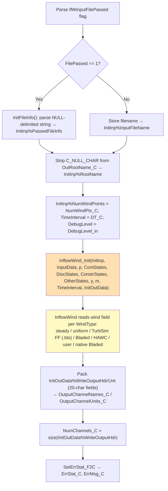
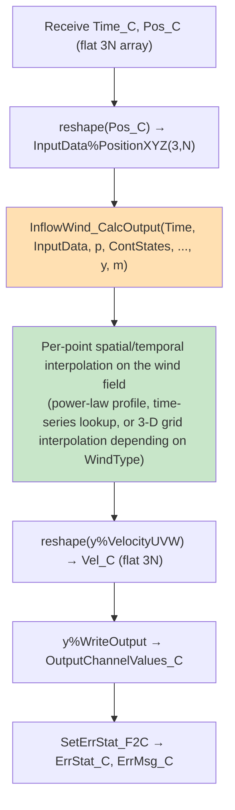
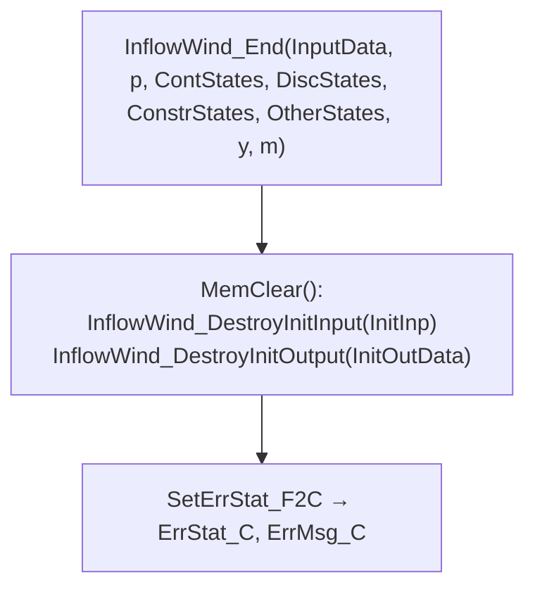
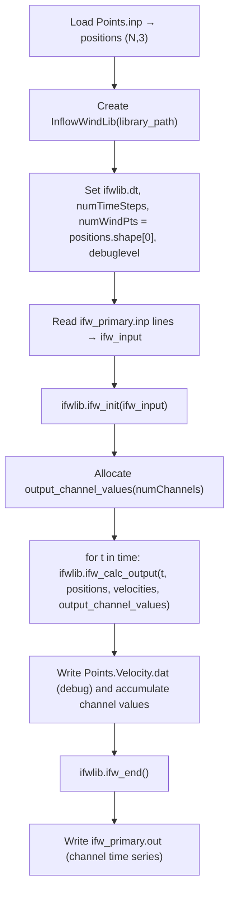

# InflowWind C-Bindings Library Interface — Data Flow Map

> **Generated:** 2026-08-05
> **Source files analyzed:**
> - [`modules/inflowwind/src/IfW_C_Binding.f90`](../../../modules/inflowwind/src/IfW_C_Binding.f90)
> - [`glue-codes/python/pyOpenFAST/inflowwind.py`](../../../glue-codes/python/pyOpenFAST/inflowwind.py) (Python wrapper `InflowWindLib`)
> - [`reg_tests/r-test/modules/inflowwind/py_ifw_turbsimff/py_ifw_driver.py`](../../../reg_tests/r-test/modules/inflowwind/py_ifw_turbsimff/py_ifw_driver.py) — TurbSim full-field wind, 50 probe points
>
> **Scope:** `IfW_C_Init`, `IfW_C_CalcOutput`, `IfW_C_End`, plus the standalone query/pointer-sharing utilities `IfW_C_GetWindVel`, `IfW_C_GetFlowFieldPointer`, `IfW_C_SetFlowFieldPointer`.

---

## Table of Contents

1. [High-Level Calling Sequence](#1-high-level-calling-sequence)
2. [Point Convention & Array Layout](#2-point-convention--array-layout)
3. [Step 1 — `IfW_C_Init`](#3-step-1--ifw_c_init)
4. [Step 2 — `IfW_C_CalcOutput`](#4-step-2--ifw_c_calcoutput)
5. [Step 3 — `IfW_C_End`](#5-step-3--ifw_c_end)
6. [Utility Routines: Single-Point Query and FlowField Pointer Sharing](#6-utility-routines-single-point-query-and-flowfield-pointer-sharing)
7. [Python Wrapper Implementation](#7-python-wrapper-implementation)
8. [Example Driver Usage](#8-example-driver-usage)
9. [Error Handling Conventions](#9-error-handling-conventions)
10. [Key Architectural Notes and Differences from HydroDyn/AeroDyn-Inflow](#10-key-architectural-notes-and-differences-from-hydrodynaerodyn-inflow)

---

## 1. High-Level Calling Sequence

```mermaid
sequenceDiagram
    participant Py as Python Driver
    participant Lib as InflowWindLib (ctypes)
    participant F as IfW_C_Binding (Fortran)
    participant IFW as InflowWind Core

    Note over Py,IFW: ── INITIALIZATION (once) ──
    Py->>Lib: ifw_init(input_file_array)
    Lib->>F: IfW_C_Init(IfWinputFilePassed, IfWinputFileString_C, OutRootName_C, NumWindPts_C, DT_C, DebugLevel_in, ...)
    F->>IFW: InflowWind_Init(InitInp, InputData, p, ContStates, ..., y, m, InitOutData)
    IFW->>IFW: Read/parse wind field (steady, uniform, TurbSim FF, Bladed, HAWC, ...)
    F->>F: Pack InitOutData%WriteOutputHdr/Unt → OutputChannelNames_C/OutputChannelUnits_C
    F-->>Lib: NumChannels_C, OutputChannelNames_C, OutputChannelUnits_C
    Lib-->>Py: numChannels, output_channel_names, output_channel_units

    Note over Py,IFW: ── TIME STEPPING (each t) ──

    rect rgb(230, 245, 255)
        Note over Py: Set probe positions for time t (N points, [x,y,z] each)
        Py->>Lib: ifw_calc_output(t, positions, velocities, output_channel_values)
        Lib->>F: IfW_C_CalcOutput(Time_C, Pos_C[3xN], Vel_C[3xN] OUT, OutputChannelValues_C OUT)
        F->>F: reshape(Pos_C) → InputData%PositionXYZ(3,N)
        F->>IFW: InflowWind_CalcOutput(Time, InputData, p, ..., y, m) → y%VelocityUVW(3,N), y%WriteOutput
        F->>F: reshape(y%VelocityUVW) → Vel_C[3xN]; y%WriteOutput → OutputChannelValues_C
        F-->>Lib: Vel_C, OutputChannelValues_C, ErrStat_C
        Lib-->>Py: velocities[N,3], output_channel_values[NumChannels]
    end

    Note over Py,IFW: ── CLEANUP ──
    Py->>Lib: ifw_end()
    Lib->>F: IfW_C_End()
    F->>IFW: InflowWind_End(InputData, p, ContStates, ..., y, m)
    F->>F: MemClear() — destroy InitInp, InitOutData
```

### Key architectural difference from HydroDyn/AeroDyn-Inflow

InflowWind's C-binding is **stateless and mesh-free**. There is no `UpdateStates` routine, no interface meshes, and no state cycling logic — each `IfW_C_CalcOutput` call is an independent lookup of the (possibly time-varying) wind field at a fixed set of `N` probe points. This makes InflowWind the simplest of the four C-bindings covered by this document series.

---

## 2. Point Convention & Array Layout

InflowWind samples wind at `NumWindPts` independent probe points in the global inertial frame (no rigid-body reference, no rotation/moment data).

| Aspect | Convention |
|--------|-----------|
| Number of points | `NumWindPts` — fixed at `IfW_C_Init`; cannot change afterward |
| Position array | `Pos_C`, size `3 x NumWindPts`, `c_float`: `[x₁,y₁,z₁, x₂,y₂,z₂, ...]` |
| Velocity array | `Vel_C`, size `3 x NumWindPts`, `c_float`: `[u₁,v₁,w₁, u₂,v₂,w₂, ...]` (m/s) |
| Coordinate system | Global inertial frame (X-East, Y-North, Z-Up); `PropagationDir` in the input file rotates the wind field relative to this frame |
| Time | Scalar `c_double`, passed on every `IfW_C_CalcOutput` call |
| Output channels | `NumChannels` `c_float` values, per the input file `OutList`/`NWindVel` point list |

Fortran-side reshape ([`IfW_C_Binding.f90`](../../../modules/inflowwind/src/IfW_C_Binding.f90)):
```fortran
InputData%PositionXYZ = reshape( real(Pos_C, ReKi), (/3, InitInp%NumWindPoints/) )
...
Vel_C = reshape( REAL(y%VelocityUVW, C_FLOAT), (/3*InitInp%NumWindPoints/) )
```

Only translational velocity is returned — no acceleration, orientation, or moment data crosses the C boundary.

---

## 3. Step 1 — `IfW_C_Init`

### Signature

```fortran
SUBROUTINE IfW_C_Init( &
    IfWinputFilePassed, IfWinputFileString_C, IfWinputFileStringLength_C, &
    OutRootName_C, &
    NumWindPts_C, DT_C, DebugLevel_in, &
    NumChannels_C, OutputChannelNames_C, OutputChannelUnits_C, &
    ErrStat_C, ErrMsg_C ) BIND (C, NAME='IfW_C_Init')
```

### Input Data

| Parameter | C type | Description |
|-----------|--------|-------------|
| `IfWinputFilePassed` | `c_int` | 0 = filename passed; 1 = file content as NULL-delimited string |
| `IfWinputFileString_C` | `c_ptr` | Input file (either the path, or the full contents with lines joined by `C_NULL_CHAR`) |
| `IfWinputFileStringLength_C` | `c_int` | Length of the above string |
| `OutRootName_C` | `c_char[1025]` | Root name for echo/output files |
| `NumWindPts_C` | `c_int` | Number of wind probe points — fixed for the life of the instance |
| `DT_C` | `c_double` | Time step (s) — accepted but not used internally by InflowWind |
| `DebugLevel_in` | `c_int` | 0–4 debug verbosity |

### Output Data

| Parameter | C type | Description |
|-----------|--------|-------------|
| `NumChannels_C` | `c_int` | Total output channels (`size(InitOutData%WriteOutputHdr)`) |
| `OutputChannelNames_C` | `c_char[ChanLen*MaxOutPts+1]` | Fixed-width (`ChanLen`=20) channel names, concatenated, NULL-terminated |
| `OutputChannelUnits_C` | `c_char[ChanLen*MaxOutPts+1]` | Fixed-width channel units, same layout |
| `ErrStat_C` / `ErrMsg_C` | `c_int` / `c_char[8197]` | Error status/message |

### Internal Sequence



All module-level state (`InputData`, `p`, `ContStates`, `DiscStates`, `ConstrStates`, `OtherStates`, `y`, `m`) is allocated here and persists until `IfW_C_End`. There is only **one** InflowWind instance per process (module-level, not thread-safe / not multi-instance capable).

---

## 4. Step 2 — `IfW_C_CalcOutput`

### Signature

```fortran
SUBROUTINE IfW_C_CalcOutput( &
    Time_C, Pos_C, Vel_C, OutputChannelValues_C, &
    ErrStat_C, ErrMsg_C ) BIND (C, NAME='IfW_C_CalcOutput')
```

### Input / Output Data

| Parameter | C type | Size | Intent | Description |
|-----------|--------|------|--------|-------------|
| `Time_C` | `c_double` | scalar | in | Simulation time (s) |
| `Pos_C` | `c_float` | `3 x NumWindPts` | in | Probe positions `[x,y,z]` per point |
| `Vel_C` | `c_float` | `3 x NumWindPts` | out | Computed wind velocity `[u,v,w]` per point (m/s) |
| `OutputChannelValues_C` | `c_float` | `NumChannels` | out | Output channel values (per input-file `OutList`) |
| `ErrStat_C` / `ErrMsg_C` | `c_int` / `c_char[8197]` | | out | Error status/message |

### Internal Flow



No mesh mapping and **no state update** occur — the same call may be repeated at the same `Time_C` with different `Pos_C` values (e.g. for a predictor/corrector loop) with no special handling required, unlike HydroDyn/MoorDyn/AeroDyn-Inflow which must track correction steps.

---

## 5. Step 3 — `IfW_C_End`

```fortran
SUBROUTINE IfW_C_End(ErrStat_C, ErrMsg_C) BIND (C, NAME='IfW_C_End')
```



---

## 6. Utility Routines: Single-Point Query and FlowField Pointer Sharing

These three routines are not exercised by the standard init → calc-output → end sequence but are present in the source for advanced use.

### 6.1 `IfW_C_GetWindVel` — single-point convenience query

```fortran
SUBROUTINE IfW_C_GetWindVel(Time_C, Pos_C, Vel_C, ErrStat_C, ErrMsg_C) BIND (C, NAME='IfW_C_GetWindVel')
```

| Parameter | C type | Size | Intent | Description |
|-----------|--------|------|--------|-------------|
| `Time_C` | `c_double` | scalar | in | Simulation time (s) |
| `Pos_C` | `c_float` | 3 | in | Single position `[x,y,z]` |
| `Vel_C` | `c_float` | 3 | out | Single velocity `[u,v,w]` |

Validates `p%FlowField` is associated, then calls `IfW_FlowField_GetVelAcc` directly for one node — a lighter-weight alternative to `IfW_C_CalcOutput` when only one point is needed and the multi-point array machinery is not wanted. Requires `IfW_C_Init` to have run first.

### 6.2 `IfW_C_GetFlowFieldPointer` — export the wind field object

```fortran
SUBROUTINE IfW_C_GetFlowFieldPointer(FlowFieldPointer_C, ErrStat_C, ErrMsg_C) BIND (C, NAME='IfW_C_GetFlowFieldPointer')
```

Returns `C_LOC(p%FlowField)` — a `c_ptr` to the internal `IfW_FlowField_Type` object. This lets a companion module (e.g. AeroDyn-Inflow's `ADI_C_PreInit` with `externFlowField_in=1`) share the exact same wind field data without re-reading/re-initializing it.

### 6.3 `IfW_C_SetFlowFieldPointer` — import an externally-owned wind field

```fortran
SUBROUTINE IfW_C_SetFlowFieldPointer(FlowFieldPointer_C, ErrStat_C, ErrMsg_C) BIND (C, NAME='IfW_C_SetFlowFieldPointer')
```

Calls `C_F_POINTER(FlowFieldPointer_C, p%FlowField)` and validates `p%FlowField%FieldType > 0`.

> **Not currently public.** The source contains a `FIXME` noting that `IfW_C_Init` would need to support creating an "empty" InflowWind instance before this routine could be safely exposed — today it exists in the module but is not part of the supported public entry points used by the Python wrapper or by other modules.

---

## 7. Python Wrapper Implementation

**File:** [`glue-codes/python/pyOpenFAST/inflowwind.py`](../../../glue-codes/python/pyOpenFAST/inflowwind.py) — class `InflowWindLib` (subclass of `OpenFASTInterfaceType`, itself a `ctypes.CDLL` wrapper).

### Key configuration attributes (set before calling `ifw_init`)

```python
self.IfWinputPass  = 1     # 1 = pass file contents as a string
self.numWindPts     = 0     # must be set by caller before ifw_init
self.dt             = 0
self.debuglevel     = 0
self.outRootName    = "Output_ifwlib_default"
```

### `ifw_init(IfW_input_string_array)`

Joins the input-file lines with `'\x00'`, encodes to bytes, and calls `IfW_C_Init` — passing the file string as `c_char_p` (not `byref`) while all scalar in/out arguments use `POINTER()`/`byref()`. Populates `self.numChannels`, `self.output_channel_names`, `self.output_channel_units` (parsed from the fixed 20-character concatenated buffers via `.split()`).

### `ifw_calc_output(time, positions, velocities, outputChannelValues)`

Flattens the caller-supplied `(N,3)` `positions` array into a `c_float` array, calls `IfW_C_CalcOutput`, then reshapes the returned flat `Vel_C` back into the caller's `(N,3)` `velocities` array and copies channel values into `outputChannelValues`.

### `ifw_end()`

Guards against double-calling; calls `IfW_C_End`.

### Error handling — `check_error()`

If `ErrStat >= abort_error_level` (4 = Fatal), prints the message, calls `ifw_end()`, and raises a Python `Exception`. Lower severities are printed but do not abort.

---

## 8. Example Driver Usage

**File:** [`reg_tests/r-test/modules/inflowwind/py_ifw_turbsimff/py_ifw_driver.py`](../../../reg_tests/r-test/modules/inflowwind/py_ifw_turbsimff/py_ifw_driver.py)

Uses [`ifw_primary.inp`](../../../reg_tests/r-test/modules/inflowwind/py_ifw_turbsimff/ifw_primary.inp) (`WindType=3`, TurbSim binary full-field file `90m_12mps_twr.bts`) and [`Points.inp`](../../../reg_tests/r-test/modules/inflowwind/py_ifw_turbsimff/Points.inp) (a grid of probe points).



The probe positions are held fixed across the ~9 timesteps (30.0–30.8 s at `dt=0.1`) in this regression case; a real coupling would update `positions` each step (e.g. to follow blade-node motion).

---

## 9. Error Handling Conventions

| `ErrStat_C` | Name | Action |
|-------------|------|--------|
| 0 | `ErrID_None` | Continue |
| 1 | `ErrID_Info` | Continue (printed by Python wrapper if `< abort_error_level`) |
| 2 | `ErrID_Warn` | Continue, printed |
| 3 | `ErrID_Severe` | Continue, printed |
| 4 | `ErrID_Fatal` | Python wrapper calls `ifw_end()` and raises |

Common causes: invalid/missing input file or wind data file (e.g. `.bts` not found) at init, `NumWindPts_C <= 0`, or probe positions outside the wind-field grid bounds at `CalcOutput` (typically a warning, with edge/zero values returned).

---

## 10. Key Architectural Notes and Differences from HydroDyn/AeroDyn-Inflow

| Aspect | InflowWind | HydroDyn | AeroDyn-Inflow |
|--------|------------|----------|----------------|
| State model | Stateless — no `UpdateStates` | State-advancing | State-advancing |
| Interface meshes | None — flat position/velocity arrays only | Motion/Load point meshes | Per-blade motion/load meshes |
| Correction-step handling | Not needed (no state) | Explicit `Time_C == InputTimePrev` check | Explicit per-rotor check |
| Multi-instance | Single module-level instance only (not thread-safe) | Single instance | Multiple rotors (`NumTurbines`) in one instance |
| Data returned | Velocity only (no acceleration/force) | Force/moment, added-mass | Force/moment, hub-height velocity |
| Sharing wind data | Exposes `GetFlowFieldPointer`/`SetFlowFieldPointer` for reuse by AeroDyn-Inflow (`externFlowField_in=1`) | N/A | Can consume an externally-owned `IfW_FlowField_Type` via this pointer |

**Practical implication:** because InflowWind has no `UpdateStates` and no meshes, integrating it into a coupled solver is simpler than HydroDyn/MoorDyn/AeroDyn — the caller only needs to supply probe positions and time, and read back velocities, each step, in any order relative to other modules' state updates.
