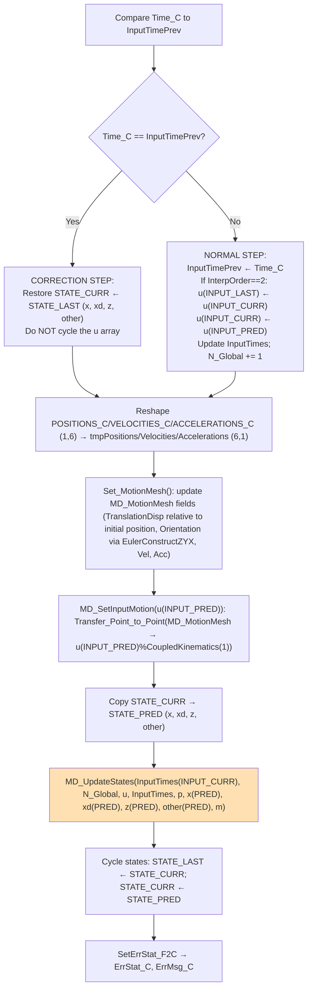
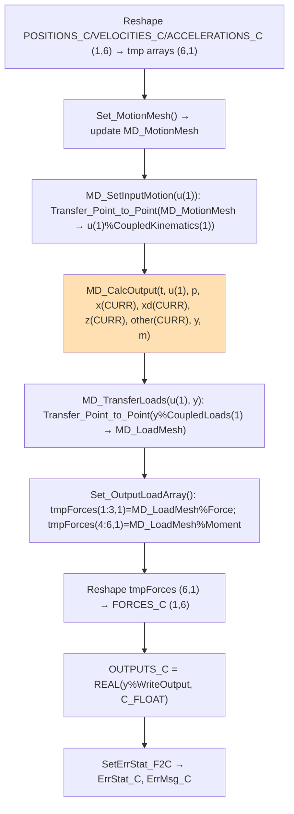
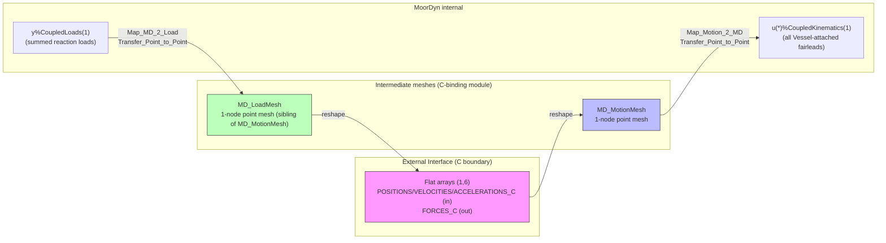
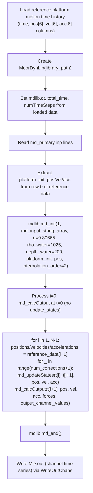

# MoorDyn C-Bindings Library Interface — Data Flow Map

> **Generated:** 2026-08-05
> **Source files analyzed:**
> - [`modules/moordyn/src/MoorDyn_C_Binding.f90`](../../../modules/moordyn/src/MoorDyn_C_Binding.f90)
> - [`glue-codes/python/pyOpenFAST/moordyn.py`](../../../glue-codes/python/pyOpenFAST/moordyn.py) (Python wrapper `MoorDynLib`)
> - [`reg_tests/r-test/modules/moordyn/py_md_5MW_OC4Semi/py_md_driver.py`](../../../reg_tests/r-test/modules/moordyn/py_md_5MW_OC4Semi/py_md_driver.py) — OC4-DeepCwind semi-submersible, 3-line mooring system
>
> **Scope:** `MD_C_Init`, `MD_C_UpdateStates`, `MD_C_CalcOutput`, `MD_C_End`, `MD_C_SetWaveFieldData`.

---

## Table of Contents

1. [High-Level Calling Sequence](#1-high-level-calling-sequence)
2. [Single-Node Rigid-Body Coupling Architecture](#2-single-node-rigid-body-coupling-architecture)
3. [Step 1 — `MD_C_Init`](#3-step-1--md_c_init)
4. [Step 2 — `MD_C_UpdateStates`](#4-step-2--md_c_updatestates)
5. [Step 3 — `MD_C_CalcOutput`](#5-step-3--md_c_calcoutput)
6. [Step 4 — `MD_C_End`](#6-step-4--md_c_end)
7. [`MD_C_SetWaveFieldData` — Sharing a SeaState Wave Field](#7-md_c_setwavefielddata--sharing-a-seastate-wave-field)
8. [Mesh Architecture and Mappings](#8-mesh-architecture-and-mappings)
9. [Correction-Step Logic](#9-correction-step-logic)
10. [Python Wrapper Implementation](#10-python-wrapper-implementation)
11. [Example Driver Usage](#11-example-driver-usage)
12. [Error Handling Conventions](#12-error-handling-conventions)
13. [Key Architectural Notes](#13-key-architectural-notes)

---

## 1. High-Level Calling Sequence

```mermaid
sequenceDiagram
    participant Py as Python Driver
    participant Lib as MoorDynLib (ctypes)
    participant F as MoorDyn_C_Binding (Fortran)
    participant MD as MoorDyn Core

    Note over Py,MD: ── INITIALIZATION ──
    Py->>Lib: md_init(passed, input_string_array, g, rho_water, depth_water, ptfm_init_pos, interp_order)
    Lib->>F: MD_C_Init(InputFilePassed, InputFileString_C, DT_C, G_C, RHO_C, DEPTH_C, PtfmInit_C[6], InterpOrder_C, ...)
    F->>MD: MD_Init(InitInp, u(1), p, x(CURR), xd(CURR), z(CURR), other(CURR), y, m, dT_Global, InitOutData)
    F->>F: SetMotionLoadsInterfaceMeshes() → MD_MotionMesh(1 node), MD_LoadMesh(sibling), Map_Motion_2_MD, Map_MD_2_Load
    F->>F: Copy u(1) → u(2..InterpOrder+1); copy states CURR → PRED, CURR → LAST
    F-->>Lib: NumChannels_C, OutputChannelNames_C, OutputChannelUnits_C
    Lib-->>Py: numChannels, output_channel_names, output_channel_units

    Note over Py,MD: ── TIME STEPPING (each dt) ──

    rect rgb(230, 245, 255)
        Note over Py: Set position/velocity/acceleration for T+dt (1 node, 6 DOF)
        Py->>Lib: md_updateStates(t, t+dt, pos[6], vel[6], acc[6])
        Lib->>F: MD_C_UpdateStates(Time_C, TimeNext_C, POSITIONS_C[1,6], VELOCITIES_C[1,6], ACCELERATIONS_C[1,6])
        F->>F: Correction-step check: Time_C == InputTimePrev ?
        F->>F: Set_MotionMesh() → MD_SetInputMotion(u(INPUT_PRED)) via Transfer_Point_to_Point
        F->>MD: MD_UpdateStates(InputTimes(CURR), N_Global, u, InputTimes, p, x(PRED), xd(PRED), z(PRED), other(PRED), m)
        F->>F: Cycle states: LAST←CURR, CURR←PRED
        F-->>Lib: ErrStat_C, ErrMsg_C
    end

    rect rgb(255, 245, 230)
        Note over Py: Set position/velocity/acceleration again for T+dt
        Py->>Lib: md_calcOutput(t+dt, pos[6], vel[6], acc[6], forces[6], output_channel_values)
        Lib->>F: MD_C_CalcOutput(Time_C, POSITIONS_C[1,6], VELOCITIES_C[1,6], ACCELERATIONS_C[1,6], FORCES_C[1,6] OUT, OUTPUTS_C OUT)
        F->>F: Set_MotionMesh() → MD_SetInputMotion(u(1))
        F->>MD: MD_CalcOutput(t, u(1), p, x(CURR), xd(CURR), z(CURR), other(CURR), y, m)
        F->>F: MD_TransferLoads(u(1), y) → Transfer_Point_to_Point(y%CoupledLoads(1), MD_LoadMesh)
        F->>F: Set_OutputLoadArray() → tmpForces → FORCES_C
        F-->>Lib: FORCES_C, OUTPUTS_C, ErrStat_C
        Lib-->>Py: forces[6], output_channel_values[NumChannels]
    end

    Note over Py,MD: ── CLEANUP ──
    Py->>Lib: md_end()
    Lib->>F: MD_C_End()
    F->>MD: MD_End(u(1), p, x(1), xd(1), z(1), other(1), y, m)
    F->>F: Destroy u(2..InterpOrder+1); destroy all state copies (LAST/CURR/PRED); ClearMesh()
```

---

## 2. Single-Node Rigid-Body Coupling Architecture

Unlike HydroDyn (`NumNodePts` external nodes, arbitrary N) or AeroDyn-Inflow (per-blade mesh points), the MoorDyn C-binding **hard-codes exactly one external coupling node** with 6 DOF.

| Property | Value | Notes |
|----------|-------|-------|
| External nodes | **1 (fixed)** | Single platform/hull reference point |
| DOFs per node | 6 | `[x, y, z, Rx, Ry, Rz]` — rotations are a small-angle Euler (ZYX) triple, in radians |
| Position/velocity/acceleration/force array size | `(1,6)` | Always shaped `(1,6)` at the C boundary, never `(N,6)` |
| Coupling model | Rigid body | All MoorDyn `Vessel`-type attachment points (fairleads) in the input file move rigidly with this single node |

```
External input (C boundary):
    One node @ [x,y,z] with small-angle rotations [Rx,Ry,Rz]
              │  (rigid-body kinematics, Transfer_Point_to_Point)
              ▼
MoorDyn internal structure:
    All "Vessel"-attached fairlead points → forced to move rigidly with the input node
    Reaction forces/moments at all fairleads are summed and returned at the single node
```

The Fortran source explicitly notes this as a `TODO`/`FIXME` for future generalization (`PtfmInit_C should be resized for N nodes ... can we not have 6 DOF only coupling?`), so a multi-node MoorDyn C-binding is not currently supported the way HydroDyn's is.

---

## 3. Step 1 — `MD_C_Init`

### Signature

```fortran
SUBROUTINE MD_C_Init( &
    InputFilePassed, InputFileString_C, InputFileStringLength_C, &
    DT_C, G_C, RHO_C, DEPTH_C, PtfmInit_C, &
    InterpOrder_C, &
    NumChannels_C, OutputChannelNames_C, OutputChannelUnits_C, &
    ErrStat_C, ErrMsg_C ) BIND (C, NAME='MD_C_Init')
```

### Input Data

| Parameter | C type | Description |
|-----------|--------|-------------|
| `InputFilePassed` | `c_int` | 0 = filename; 1 = file contents as NULL-delimited string |
| `InputFileString_C` | `c_ptr` | Input file path or contents |
| `InputFileStringLength_C` | `c_int` | Length of the above string |
| `DT_C` | `c_double` | Global time step (s) — used to build `InputTimes` and drive `N_Global` |
| `G_C` | `c_float` | Gravitational acceleration (m/s²) |
| `RHO_C` | `c_float` | Water density (kg/m³) |
| `DEPTH_C` | `c_float` | Water depth (m) |
| `PtfmInit_C` | `c_float[6]` | Initial platform position/orientation `[x,y,z,Rx,Ry,Rz]` (m, m, m, rad, rad, rad) |
| `InterpOrder_C` | `c_int` | 1 (linear, 2 time levels) or 2 (quadratic, 3 time levels) |

### Output Data

| Parameter | C type | Description |
|-----------|--------|-------------|
| `NumChannels_C` | `c_int` | Total MoorDyn output channels |
| `OutputChannelNames_C` | `c_char[ChanLen*1000]` | Fixed-width (`ChanLen`=20) channel names, concatenated |
| `OutputChannelUnits_C` | `c_char[ChanLen*1000]` | Fixed-width channel units |
| `ErrStat_C` / `ErrMsg_C` | `c_int` / `c_char[ErrMsgLen_C]` | Error status/message |

### Internal Initialization Sequence

```mermaid
flowchart TD
    A["Destroy any prior module-level state (u, p, x/xd/z/other(0:2), y, m)"] --> B["NWTC_Init, DispCopyrightLicense, DispCompileRuntimeInfo"]
    B --> C["Parse InputFilePassed → InitInp%PassedPrimaryInputData or InitInp%FileName"]
    C --> D["Validate InterpOrder ∈ {1,2}; AllocAry(InputTimes, InterpOrder+1)"]
    D --> E["dT_Global = DT_C; N_Global = 0; InitInp%RootName = 'MDroot'"]
    E --> F["InitInp%g/rhoW/WtrDepth = G_C/RHO_C/DEPTH_C"]
    F --> G["AllocAry(InitInp%PtfmInit,6,1); copy PtfmInit_C(1:6) → InitInp%PtfmInit(:,1)"]
    G --> H["ALLOCATE(u(InterpOrder+1))"]
    H --> I["MD_Init(InitInp, u(1), p, x(CURR), xd(CURR), z(CURR), other(CURR), y, m, dT_Global, InitOutData)"]
    I --> J["NumChannels_C = size(InitOutData%WriteOutputHdr)<br/>Pack WriteOutputHdr/Unt (20-char fields) → OutputChannelNames/Units_C"]
    J --> K["tmpPositions(1:6,1) = PtfmInit_C; tmpVelocities=0; tmpAccelerations=0"]
    K --> L["SetMotionLoadsInterfaceMeshes(): create MD_MotionMesh(1 node), MD_LoadMesh (sibling), Map_Motion_2_MD, Map_MD_2_Load"]
    L --> M["Copy u(1) → u(2..InterpOrder+1) (MD_CopyInput, MESH_NEWCOPY)"]
    M --> N["InputTimePrev = -dT_Global (init for correction-step check)"]
    N --> O["Copy STATE_CURR → STATE_PRED and → STATE_LAST for x, xd, z, other"]
    O --> P["Destroy InitInp, InitOutData (no longer needed)"]
    P --> Q["SetErrStat_F2C → ErrStat_C, ErrMsg_C"]

    style I fill:#ffe0b2
    style L fill:#ffe0b2
```



### `SetMotionLoadsInterfaceMeshes` detail

- **Motion mesh (`MD_MotionMesh`):** a 1-node point mesh with `TranslationDisp`, `Orientation`, `TranslationVel`, `RotationVel`, `TranslationAcc`, `RotationAcc`. Initial orientation is built from the small-angle Euler triple via `EulerConstructZYX`.
- **Load mesh (`MD_LoadMesh`):** created as a `MESH_SIBLING` of the motion mesh (`COMPONENT_OUTPUT`) with `Force`/`Moment` fields.
- **Mappings:** `Map_Motion_2_MD` maps `MD_MotionMesh → u(1)%CoupledKinematics(1)`; `Map_MD_2_Load` maps `y%CoupledLoads(1) → MD_LoadMesh`.

---

## 4. Step 2 — `MD_C_UpdateStates`

### Signature

```fortran
SUBROUTINE MD_C_UpdateStates(Time_C, TimeNext_C, POSITIONS_C, VELOCITIES_C, ACCELERATIONS_C, ErrStat_C, ErrMsg_C) &
    BIND (C, NAME='MD_C_UpdateStates')
```

### Input Data

| Parameter | C type | Size | Description |
|-----------|--------|------|-------------|
| `Time_C` | `c_double` | scalar | Current time T (s) |
| `TimeNext_C` | `c_double` | scalar | Next time T+dt (s) |
| `POSITIONS_C` | `c_float` | `(1,6)` | Position at T+dt: `[x,y,z,Rx,Ry,Rz]` (m, rad) |
| `VELOCITIES_C` | `c_float` | `(1,6)` | Velocity at T+dt: `[Vx,Vy,Vz,RVx,RVy,RVz]` (m/s, rad/s) |
| `ACCELERATIONS_C` | `c_float` | `(1,6)` | Acceleration at T+dt: `[Ax,Ay,Az,RAx,RAy,RAz]` (m/s², rad/s²) |

### Internal Logic



Note the **input-array index convention** used here (identical pattern to HydroDyn, but MoorDyn's C-binding comments call out that it's non-obvious): `INPUT_PRED=1` (T+dt), `INPUT_CURR=2` (T), `INPUT_LAST=3` (T−dt); whereas the **state** indices are `STATE_LAST=0`, `STATE_CURR=1`, `STATE_PRED=2`.

---

## 5. Step 3 — `MD_C_CalcOutput`

### Signature

```fortran
SUBROUTINE MD_C_CalcOutput(Time_C, POSITIONS_C, VELOCITIES_C, ACCELERATIONS_C, FORCES_C, OUTPUTS_C, ErrStat_C, ErrMsg_C) &
    BIND (C, NAME='MD_C_CalcOutput')
```

### Input Data

| Parameter | C type | Size | Description |
|-----------|--------|------|-------------|
| `Time_C` | `c_double` | scalar | Time for output calculation |
| `POSITIONS_C` | `c_float` | `(1,6)` | Position `[x,y,z,Rx,Ry,Rz]` |
| `VELOCITIES_C` | `c_float` | `(1,6)` | Velocity |
| `ACCELERATIONS_C` | `c_float` | `(1,6)` | Acceleration |

### Output Data

| Parameter | C type | Size | Description |
|-----------|--------|------|-------------|
| `FORCES_C` | `c_float` | `(1,6)` | Reaction force/moment at the node: `[Fx,Fy,Fz,Mx,My,Mz]` (N, N·m) |
| `OUTPUTS_C` | `c_float` | `p%NumOuts` | MoorDyn output channels (e.g. `FairTen1`, `AnchTen1`, ...) |
| `ErrStat_C` / `ErrMsg_C` | `c_int` / `c_char[ErrMsgLen_C]` | | Error status/message |

### Internal Flow



`MD_CalcOutput` uses **`x(STATE_CURR)`**, i.e. the states already advanced by the preceding `MD_C_UpdateStates` call — this mirrors the standard OpenFAST pattern of "update states to T+dt, then calc output at T+dt using those states."

---

## 6. Step 4 — `MD_C_End`

```fortran
SUBROUTINE MD_C_End(ErrStat_C, ErrMsg_C) BIND (C, NAME='MD_C_End')
```

| Action | Detail |
|--------|--------|
| Guard | Only proceeds with `MD_End` if `u` is allocated (protects against calling `End` before/without a successful `Init`) |
| End MoorDyn core | `MD_End(u(1), p, x(1), xd(1), z(1), other(1), y, m)` |
| Destroy extra `u` instances | `MD_DestroyInput(u(i))` for `i=2..size(u)` — `MD_End` only accepts one `u`, so the C-binding must clean up `u(2)`/`u(3)` itself |
| Destroy state copies | `x`, `xd`, `z`, `other` for `STATE_LAST`, `STATE_CURR`, `STATE_PRED` |
| Deallocate | `InputTimes` |
| `ClearMesh()` | `MeshDestroy(MD_MotionMesh)`, `MeshDestroy(MD_LoadMesh)`, `NWTC_Library_Destroymeshmaptype(Map_Motion_2_MD)`, `NWTC_Library_Destroymeshmaptype(Map_MD_2_Load)` |

---

## 7. `MD_C_SetWaveFieldData` — Sharing a SeaState Wave Field

```fortran
SUBROUTINE MD_C_SetWaveFieldData(WaveFieldData_C) BIND (C, NAME='MD_C_SetWaveFieldData')
    TYPE(C_PTR), INTENT(IN) :: WaveFieldData_C
    call C_F_POINTER(WaveFieldData_C, InitInp%WaveField)
END SUBROUTINE
```

This routine accepts a `c_ptr` (as returned by, e.g., [`SeaSt_C_GetWaveFieldPointer`](SeaState_C_Binding_Interface_Map.md#7-step-4--wave-field-query-subroutines)) and associates it with `InitInp%WaveField` **before** `MD_C_Init` is called, so that MoorDyn's wave-current forcing on mooring lines can use the same wave kinematics grid computed by a SeaState instance, instead of recomputing/duplicating it. It must be called prior to `MD_C_Init` since `InitInp%WaveField` is consumed during `MD_Init`.

---

## 8. Mesh Architecture and Mappings



Because there is only one external node, both mesh mappings are effectively rigid-body 1-to-1 (or 1-to-N-fairlead) transfers — no interpolation ambiguity exists as it might with HydroDyn's N>1 case.

---

## 9. Correction-Step Logic

Identical philosophy to HydroDyn: the C-binding must manage input/state history itself because state does not cross the C boundary between calls.

```mermaid
stateDiagram-v2
    [*] --> CheckTime: MD_C_UpdateStates called

    CheckTime --> CorrectionStep: Time_C == InputTimePrev
    CheckTime --> NormalStep: Time_C != InputTimePrev

    state NormalStep {
        [*] --> CycleInputs: if InterpOrder==2, u(CURR)->u(LAST); always u(PRED)->u(CURR)
        CycleInputs --> UpdateTimes: Update InputTimes array, N_Global += 1
        UpdateTimes --> SetNewInputs: Set motions on u(INPUT_PRED)
    }

    state CorrectionStep {
        [*] --> RestoreStates: Copy STATE_LAST -> STATE_CURR (x, xd, z, other)
        RestoreStates --> SetNewInputs2: Set motions on u(INPUT_PRED)
    }

    NormalStep --> RunUpdateStates
    CorrectionStep --> RunUpdateStates

    state RunUpdateStates {
        [*] --> CopyCurrToPred: STATE_CURR -> STATE_PRED
        CopyCurrToPred --> CallMD: MD_UpdateStates(...)
        CallMD --> CycleStates: LAST<-CURR, CURR<-PRED
    }
```

The [example driver](#11-example-driver-usage) exercises this path via its `num_corrections` configuration option, which repeats `_process_timestep(..., update_states=True, previous_time=...)` for the same `(previous_time, current_time)` pair.

---

## 10. Python Wrapper Implementation

**File:** [`glue-codes/python/pyOpenFAST/moordyn.py`](../../../glue-codes/python/pyOpenFAST/moordyn.py) — class `MoorDynLib`.

### `md_init(input_file_passed, input_string_array, g, rho_water, depth_water, platform_init_pos, interpOrder)`

Joins input lines with `\x00`, encodes to bytes, builds a `(c_float*6)` array from `platform_init_pos`, and calls `MD_C_Init`. All scalar arguments (including the input string length, `dt`, `g`, `rho_water`, `depth_water`, `interpOrder`) are passed via `byref(c_TYPE(...))`; the encoded input string itself is passed as `c_char_p` (no `byref`).

### `md_calcOutput(t, positions, velocities, accelerations, forces, output_channel_values)`

Builds four `(c_float*6)` arrays from the length-6 Python lists/arrays `positions`, `velocities`, `accelerations`, `forces`, plus a `(c_float*numChannels)` output buffer, calls `MD_C_CalcOutput`, then copies `forces_c` and `outputs_c` back into the caller's `forces`/`output_channel_values` in place.

### `md_updateStates(t1, t2, positions, velocities, accelerations)`

Same array marshalling pattern as `md_calcOutput`, but with no output arrays — calls `MD_C_UpdateStates(byref(c_double(t1)), byref(c_double(t2)), positions_c, velocities_c, accelerations_c, ...)`.

### `md_end()`

Guards against double-ending; calls `MD_C_End`.

### Error handling — `check_error()`

Same convention as InflowWind/HydroDyn: `ErrStat >= abort_error_level` prints, calls `md_end()`, and raises.

### Helper classes

- `WriteOutChans`: writes the accumulated output-channel time series to a text file with header/units rows (mirrors the standard OpenFAST `.out` format).
- `DriverDbg`: optional debug writer that logs the raw position/velocity/acceleration/force vectors passed across the interface at every call, for verifying I/O against the MoorDyn output channels.

---

## 11. Example Driver Usage

**File:** [`reg_tests/r-test/modules/moordyn/py_md_5MW_OC4Semi/py_md_driver.py`](../../../reg_tests/r-test/modules/moordyn/py_md_5MW_OC4Semi/py_md_driver.py)

Uses [`md_primary.inp`](../../../reg_tests/r-test/modules/moordyn/py_md_5MW_OC4Semi/md_primary.inp) — the OC4-DeepCwind semi-submersible 3-line catenary mooring system (3 anchors `Fixed`, 3 fairleads `Vessel`) — and a reference motion time history (`5MW_OC4Semi_WSt_WavesWN.out`, an OpenFAST regression-test output file used here purely as a **driving-motion input**, not as validation data).



Key configuration used: `interpolation_order=2` (quadratic), `gravity=9.80665`, `water_density=1025`, `water_depth=200`, `num_corrections=0` by default (configurable to exercise the correction-step path).

---

## 12. Error Handling Conventions

| `ErrStat_C` | Name | Action |
|-------------|------|--------|
| 0 | `ErrID_None` | Continue |
| 1 | `ErrID_Warn` (per NWTC convention: 1=Info in the shared 5-level scheme, but MoorDyn's Python wrapper treats 1–3 as non-fatal) | Continue, printed |
| 2–3 | `ErrID_Warn`/`ErrID_Severe` | Continue, printed |
| 4 | `ErrID_Fatal` (`AbortErrLev`) | Python wrapper calls `md_end()` and raises |

`ErrMsg_C` is a NULL-terminated `c_char[ErrMsgLen_C]` buffer set via `SetErrStat_F2C`. Common causes: invalid input file/line/point/connection definitions at `MD_C_Init`, `InterpOrder_C` not in `{1,2}`, or numerical divergence of the mooring-line integrator during `MD_UpdateStates`/`MD_CalcOutput`.

---

## 13. Key Architectural Notes

| Aspect | MoorDyn | HydroDyn | InflowWind |
|--------|---------|----------|------------|
| External nodes | **1 (fixed)** | 1–N (`NumNodePts`) | N (`NumWindPts`, independent points, no rigid-body coupling) |
| State model | State-advancing (`UpdateStates` + `CalcOutput`) | State-advancing | Stateless |
| Correction-step handling | Explicit `Time_C == InputTimePrev` check (same pattern as HydroDyn) | Explicit `Time_C == InputTimePrev` check | Not applicable |
| Mesh mappings | 2 (`Map_Motion_2_MD`, `Map_MD_2_Load`), single node | Up to 5 (PRP/WAMIT/Morison in, WAMIT/Morison out) | None |
| Data exchanged | Position/velocity/acceleration in; force/moment out | Position/velocity/acceleration in; force/moment (+added mass) out | Position in; velocity out |
| External data sharing | `MD_C_SetWaveFieldData` accepts a SeaState `WaveField` pointer | HydroDyn owns/consumes its own `WaveField` (potentially shared via SeaState's pointer routines) | `IfW_C_GetFlowFieldPointer`/`SetFlowFieldPointer` share wind field with AeroDyn-Inflow |
| Multi-instance | Single module-level instance only | Single instance | Single instance |

**Practical implication:** a coupled simulation driving MoorDyn from an external structural solver only ever needs to track **one** 6-DOF coupling point (typically the platform reference point), regardless of how many individual mooring lines, connections, or anchors are defined in the `.dat`/`.inp` input file — all of that internal topology is resolved by MoorDyn itself and is invisible at the C boundary.
