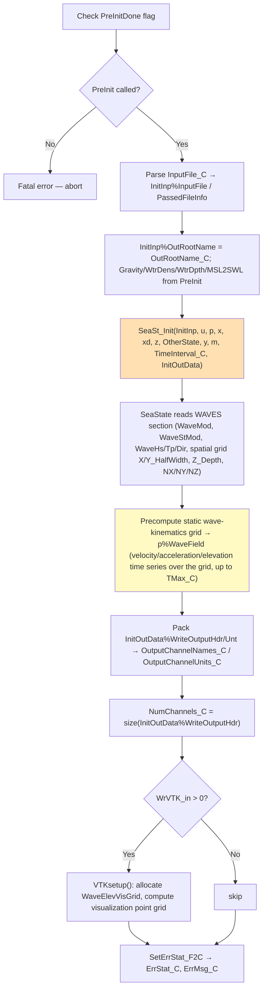
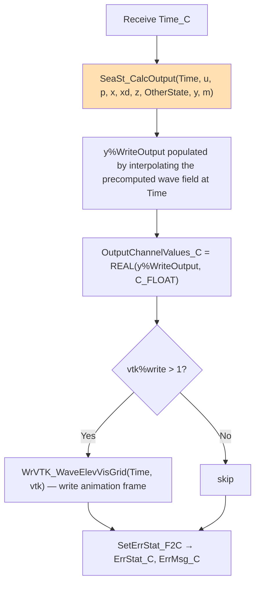
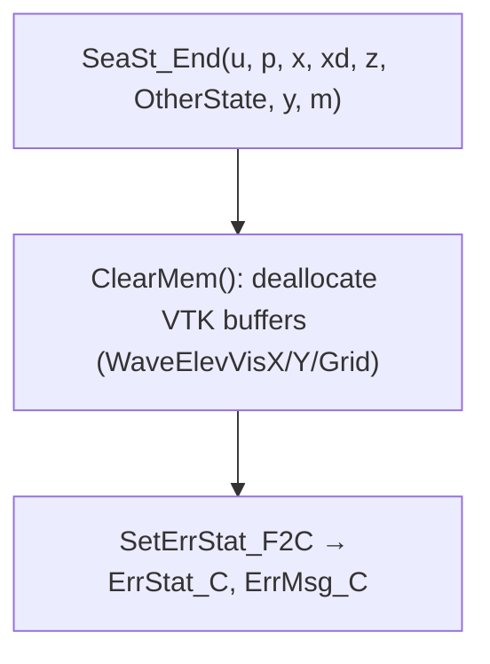
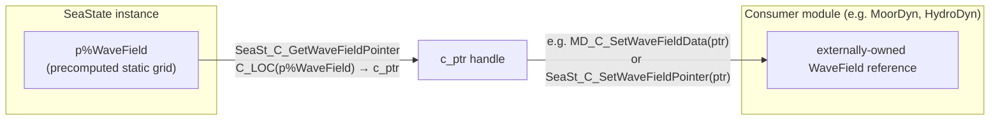
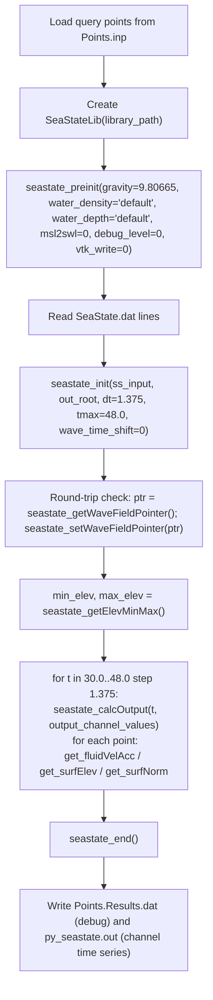

# SeaState C-Bindings Library Interface — Data Flow Map

> **Generated:** 2026-08-05
> **Source files analyzed:**
> - [`modules/seastate/src/SeaState_C_Binding.f90`](../../../modules/seastate/src/SeaState_C_Binding.f90)
> - [`glue-codes/python/pyOpenFAST/seastate.py`](../../../glue-codes/python/pyOpenFAST/seastate.py) (Python wrapper `SeaStateLib`)
> - [`reg_tests/r-test/modules/seastate/py_seastate_1/py_seastate_driver.py`](../../../reg_tests/r-test/modules/seastate/py_seastate_1/py_seastate_driver.py) — JONSWAP irregular-wave field, grid query points
>
> **Scope:** all 14 public entry points — `SeaSt_C_PreInit`, `SeaSt_C_Init`, `SeaSt_C_CalcOutput`, `SeaSt_C_End`, `SeaSt_C_GetWaveFieldPointer`, `SeaSt_C_SetWaveFieldPointer`, `SeaSt_C_GetFluidVelAcc`, `SeaSt_C_GetSurfElev`, `SeaSt_C_GetSurfNorm`, `SeaSt_C_GetElevMinMaxEstimate`, `SeaSt_C_GetDens`, `SeaSt_C_GetDpth`, `SeaSt_C_GetMSL2SWL`, `SeaSt_C_GetDynPressure`.

---

## Table of Contents

1. [High-Level Calling Sequence](#1-high-level-calling-sequence)
2. [Subroutine Catalog](#2-subroutine-catalog)
3. [Setup Phase — `SeaSt_C_PreInit`](#3-setup-phase--seast_c_preinit)
4. [Setup Phase — `SeaSt_C_Init`](#4-setup-phase--seast_c_init)
5. [Query Phase — `SeaSt_C_CalcOutput`](#5-query-phase--seast_c_calcoutput)
6. [Query Phase — Point/Property Query Subroutines](#6-query-phase--pointproperty-query-subroutines)
7. [Cleanup Phase — `SeaSt_C_End`](#7-cleanup-phase--seast_c_end)
8. [WaveField Pointer Sharing](#8-wavefield-pointer-sharing)
9. [VTK Visualization Support](#9-vtk-visualization-support)
10. [Data Layout Conventions](#10-data-layout-conventions)
11. [Python Wrapper Implementation](#11-python-wrapper-implementation)
12. [Example Driver Usage](#12-example-driver-usage)
13. [Error Handling Conventions](#13-error-handling-conventions)
14. [Key Architectural Notes](#14-key-architectural-notes)

---

## 1. High-Level Calling Sequence

SeaState's C-binding is unusual among the four modules in this documentation series: it has **no `UpdateStates`** at all. It precomputes a static wave-kinematics grid once at `Init` and then serves independent, order-independent, read-only queries against that grid for the rest of the simulation.

```mermaid
sequenceDiagram
    participant Py as Python Driver
    participant Lib as SeaStateLib (ctypes)
    participant F as SeaState_C_Binding (Fortran)
    participant SS as SeaState Core

    Note over Py,SS: ── SETUP PHASE (once) ──
    Py->>Lib: seastate_preinit(gravity, water_density, water_depth, msl2swl, debug_level, vtk_dir, vtk_write, vtk_dt)
    Lib->>F: SeaSt_C_PreInit(Gravity_C, WtrDens_C, WtrDpth_C, MSL2SWL_C, DebugLevel_C, OutVTKDir_C, WrVTK_in, WrVTK_inDT)
    F->>F: PreInitDone = .true.

    Py->>Lib: seastate_init(input_file_string, out_root_name, dt, tmax, wave_time_shift)
    Lib->>F: SeaSt_C_Init(InputFile_C, OutRootName_C, TimeInterval_C, TMax_C, WaveTimeShift_C, ...)
    F->>F: Check PreInitDone; abort if not set
    F->>SS: SeaSt_Init(InitInp, u, p, x, xd, z, OtherState, y, m, TimeInterval, InitOutData)
    SS->>SS: Precompute static wave-kinematics grid (p%WaveField) from WaveMod/WaveStMod/spatial-discretization inputs
    F->>F: Pack InitOutData%WriteOutputHdr/Unt → OutputChannelNames_C/Units_C; optional VTKsetup()
    F-->>Lib: NumChannels_C, OutputChannelNames_C, OutputChannelUnits_C

    Note over Py,SS: ── QUERY PHASE (any order, any time within WaveTMax) ──

    rect rgb(230, 245, 255)
        Py->>Lib: seastate_calcOutput(time, output_channel_values)
        Lib->>F: SeaSt_C_CalcOutput(Time_C, OutputChannelValues_C OUT)
        F->>SS: SeaSt_CalcOutput(Time, u, p, x, xd, z, OtherState, y, m)
        F-->>Lib: OutputChannelValues_C
    end

    rect rgb(255, 245, 230)
        Py->>Lib: get_fluidVelAcc(time, position) / get_surfElev(...) / get_surfNorm(...) / get_dynPressure(...)
        Lib->>F: SeaSt_C_GetFluidVelAcc / GetSurfElev / GetSurfNorm / GetDynPressure
        F->>SS: WaveField_GetNodeWaveVelAcc / GetNodeTotalWaveElev / GetNodeWaveNormal / GetDynP
        F-->>Lib: Vel/Acc/Elev/NormVec/DynP + NodeInWater flag (as applicable)
    end

    Note over Py,SS: ── CLEANUP ──
    Py->>Lib: seastate_end()
    Lib->>F: SeaSt_C_End()
    F->>SS: SeaSt_End(u, p, x, xd, z, OtherState, y, m)
    F->>F: ClearMem() — destroy VTK buffers
```

---

## 2. Subroutine Catalog

| # | Subroutine | Source lines | Purpose |
|---|-----------|---------------|---------|
| 1 | `SeaSt_C_PreInit` | 92–200 | Set environment constants (gravity, density, depth, MSL2SWL); must run before `Init` |
| 2 | `SeaSt_C_Init` | 204–346 | Parse input file, build static wave-field grid, return output channel metadata |
| 3 | `SeaSt_C_CalcOutput` | 348–~417 | Evaluate `OutList` output channels at a given time (stateless) |
| 4 | `SeaSt_C_End` | 419–~440 | Tear down SeaState instance and VTK buffers |
| 5 | `SeaSt_C_GetWaveFieldPointer` | 442–~472 | Export `c_ptr` to `p%WaveField` for sharing with other modules |
| 6 | `SeaSt_C_SetWaveFieldPointer` | 474–~504 | Import an externally-owned `p%WaveField` |
| 7 | `SeaSt_C_GetFluidVelAcc` | 506–586 | Query fluid velocity/acceleration + in-water flag at `(time, x, y, z)` |
| 8 | `SeaSt_C_GetSurfElev` | 591–650 | Query total wave elevation at `(time, x, y)` |
| 9 | `SeaSt_C_GetSurfNorm` | 655–711 | Query wave surface normal vector at `(time, x, y)` |
| 10 | `SeaSt_C_GetElevMinMaxEstimate` | 716–764 | Return estimated min/max wave elevation over the whole simulation |
| 11 | `SeaSt_C_GetDens` | 771–~804 | Return `p%WaveField%WtrDens` |
| 12 | `SeaSt_C_GetDpth` | 806–~839 | Return `p%WaveField%WtrDpth` |
| 13 | `SeaSt_C_GetMSL2SWL` | 841–~898 | Return `p%WaveField%MSL2SWL` |
| 14 | `SeaSt_C_GetDynPressure` | 900–963 | Query dynamic pressure at `(time, x, y, z)` |

Module-level persistent state ([`SeaState_C_Binding.f90`](../../../modules/seastate/src/SeaState_C_Binding.f90), lines ~65–79): `u` (`SeaSt_InputType`), `InitInp`, `InitOutData`, `p` (`SeaSt_ParameterType, target` — holds `p%WaveField`), `y`, `m`, `x`, `xd`, `z`, `OtherState`; plus `DebugLevel` and `PreInitDone` flags and a `vtk` (`VTKvis`) visualization-state object.

---

## 3. Setup Phase — `SeaSt_C_PreInit`

### Signature

```fortran
subroutine SeaSt_C_PreInit(Gravity_C, WtrDens_C, WtrDpth_C, MSL2SWL_C, DebugLevel_C, &
                            OutVTKDir_C, WrVTK_in, WrVTK_inDT, ErrStat_C, ErrMsg_C) &
    BIND (C, NAME='SeaSt_C_PreInit')
```

### Input Data

| Parameter | C type | Description |
|-----------|--------|-------------|
| `Gravity_C` | `c_float` | Gravitational acceleration (m/s²) |
| `WtrDens_C` | `c_float` | Water density (kg/m³) |
| `WtrDpth_C` | `c_float` | Water depth (m) |
| `MSL2SWL_C` | `c_float` | Mean-sea-level to still-water-level offset (m) |
| `DebugLevel_C` | `c_int` | 0=none, 1=summary, 2=+position/orientation, 3=+input files, 4=+meshes |
| `OutVTKDir_C` | `c_char[IntfStrLen]` | Directory for VTK output (if enabled) |
| `WrVTK_in` | `c_int` | VTK mode: 0=off, 1=init-only, 2=animate |
| `WrVTK_inDT` | `c_double` | Time step between VTK animation frames |

### Behavior

Simply stores the passed constants into module variables and internal `InitInp` fields, and sets `PreInitDone = .true.`. **This must be called before `SeaSt_C_Init`** — `Init` checks the flag and returns a fatal error if `PreInit` was skipped.

---

## 4. Setup Phase — `SeaSt_C_Init`

### Signature

```fortran
subroutine SeaSt_C_Init(InputFile_C, OutRootName_C, TimeInterval_C, TMax_C, WaveTimeShift_C, &
                         NumChannels_C, OutputChannelNames_C, OutputChannelUnits_C, &
                         ErrStat_C, ErrMsg_C) BIND (C, NAME='SeaSt_C_Init')
```

### Input Data

| Parameter | C type | Description |
|-----------|--------|-------------|
| `InputFile_C` | `c_char[IntfStrLen]` / `c_ptr` | Input file path, or its full content (implementation supports the same passed-string convention as the other C-bindings) |
| `OutRootName_C` | `c_char[IntfStrLen]` | Root name for echo/output files |
| `TimeInterval_C` | `c_double` | Simulation time step (s) |
| `TMax_C` | `c_double` | Maximum simulation time (s) — used to size the precomputed wave-kinematics time series |
| `WaveTimeShift_C` | `c_double` | Time shift applied to the wave-kinematics time series (s) |

### Output Data

| Parameter | C type | Description |
|-----------|--------|-------------|
| `NumChannels_C` | `c_int` | Number of output channels |
| `OutputChannelNames_C` | `c_char[ChanLen*MaxOutPts+1]` | Fixed-width (20-char) concatenated channel names |
| `OutputChannelUnits_C` | `c_char[ChanLen*MaxOutPts+1]` | Fixed-width concatenated channel units |
| `ErrStat_C` / `ErrMsg_C` | `c_int` / `c_char[ErrMsgLen_C]` | Error status/message |

### Internal Sequence



The wave field is computed **once, over the whole domain and whole time range**, at `Init` — this is the key architectural difference from HydroDyn/MoorDyn, which advance state incrementally via `UpdateStates`. All subsequent query calls are just table lookups/interpolations against this precomputed grid.

---

## 5. Query Phase — `SeaSt_C_CalcOutput`

### Signature

```fortran
subroutine SeaSt_C_CalcOutput(Time_C, OutputChannelValues_C, ErrStat_C, ErrMsg_C) &
    BIND (C, NAME='SeaSt_C_CalcOutput')
```

| Parameter | C type | Size | Intent | Description |
|-----------|--------|------|--------|-------------|
| `Time_C` | `c_double` | scalar | in | Query time (s) |
| `OutputChannelValues_C` | `c_float` | `NumChannels` | out | Output channel values at `Time_C` |
| `ErrStat_C` / `ErrMsg_C` | `c_int` / `c_char[ErrMsgLen_C]` | | out | Error status/message |

### Internal Flow



There is **no state input/output** — the same `Time_C` can be queried repeatedly, out of order, with identical results (idempotent), unlike HydroDyn/MoorDyn's `CalcOutput` which depends on the state most recently advanced by `UpdateStates`.

---

## 6. Query Phase — Point/Property Query Subroutines

These routines allow other modules (or a driver) to query the precomputed wave field at arbitrary points, independent of `SeaSt_C_CalcOutput`'s fixed `OutList` channels.

### 6.1 `SeaSt_C_GetFluidVelAcc`

```fortran
subroutine SeaSt_C_GetFluidVelAcc(Time_C, Pos_C, Vel_C, Acc_C, NodeInWater_C, ErrStat_C, ErrMsg_C) &
    BIND (C, NAME='SeaSt_C_GetFluidVelAcc')
```

| Parameter | C type | Size | Intent | Description |
|-----------|--------|------|--------|-------------|
| `Time_C` | `c_double` | scalar | in | Query time (s) |
| `Pos_C` | `c_float` | 3 | in | Position `[x,y,z]` (m) |
| `Vel_C` | `c_float` | 3 | out | Fluid velocity `[u,v,w]` (m/s) |
| `Acc_C` | `c_float` | 3 | out | Fluid acceleration `[ax,ay,az]` (m/s²) |
| `NodeInWater_C` | `c_int` | scalar | out | 1 if the point is submerged, 0 otherwise |

Calls `WaveField_GetNodeWaveVelAcc`. Per the source comment: *"if wave stretching is turned off, the SWL is used as the cutoff for the nodeInWater and for Vel/Acc values"* — i.e. `WaveStMod` in the input file affects behavior near the instantaneous free surface.

### 6.2 `SeaSt_C_GetSurfElev`

```fortran
subroutine SeaSt_C_GetSurfElev(Time_C, Pos_C, Elev_C, ErrStat_C, ErrMsg_C) BIND (C, NAME='SeaSt_C_GetSurfElev')
```

| Parameter | C type | Size | Intent | Description |
|-----------|--------|------|--------|-------------|
| `Time_C` | `c_double` | scalar | in | Query time (s) |
| `Pos_C` | `c_float` | 2 | in | Position `[x,y]` (m) — no `z`, since this returns the surface height itself |
| `Elev_C` | `c_float` | scalar | out | Total instantaneous wave elevation (m, relative to SWL) |

Calls `WaveField_GetNodeTotalWaveElev`.

### 6.3 `SeaSt_C_GetSurfNorm`

```fortran
subroutine SeaSt_C_GetSurfNorm(Time_C, Pos_C, NormVec_C, ErrStat_C, ErrMsg_C) BIND (C, NAME='SeaSt_C_GetSurfNorm')
```

| Parameter | C type | Size | Intent | Description |
|-----------|--------|------|--------|-------------|
| `Time_C` | `c_double` | scalar | in | Query time (s) |
| `Pos_C` | `c_float` | 2 | in | Position `[x,y]` (m) |
| `NormVec_C` | `c_float` | 3 | out | Unit normal vector to the wave surface `[nx,ny,nz]` |

Calls `WaveField_GetNodeWaveNormal` — useful for computing local surface slope, e.g. for floating-body free-surface interaction.

### 6.4 `SeaSt_C_GetElevMinMaxEstimate`

```fortran
subroutine SeaSt_C_GetElevMinMaxEstimate(Min_C, Max_C, ErrStat_C, ErrMsg_C) BIND (C, NAME='SeaSt_C_GetElevMinMaxEstimate')
```

Returns a pre-analysis estimate of the minimum/maximum wave elevation over the whole precomputed field/time-range — useful for sizing a domain or a VTK camera before running the full time loop.

### 6.5 `SeaSt_C_GetDynPressure`

```fortran
subroutine SeaSt_C_GetDynPressure(Time_C, Pos_C, DynP_C, ErrStat_C, ErrMsg_C) BIND (C, NAME='SeaSt_C_GetDynPressure')
```

| Parameter | C type | Size | Intent | Description |
|-----------|--------|------|--------|-------------|
| `Time_C` | `c_double` | scalar | in | Query time (s) |
| `Pos_C` | `c_float` | 3 | in | Position `[x,y,z]` (m) |
| `DynP_C` | `c_float` | scalar | out | Dynamic pressure at the point (Pa) |

Calls `WaveField_GetDynP` — used, e.g., by MacCamy-Fuchs diffraction load calculations.

### 6.6 Simple property accessors

| Subroutine | Signature | Returns |
|-----------|-----------|---------|
| `SeaSt_C_GetDens` | `(Dens_C, ErrStat_C, ErrMsg_C)` | `p%WaveField%WtrDens` (`c_float`, kg/m³) |
| `SeaSt_C_GetDpth` | `(Dpth_C, ErrStat_C, ErrMsg_C)` | `p%WaveField%WtrDpth` (`c_float`, m) |
| `SeaSt_C_GetMSL2SWL` | `(MSL2SWL_C, ErrStat_C, ErrMsg_C)` | `p%WaveField%MSL2SWL` (`c_float`, m) |

These are trivial pass-throughs, provided so a coupled module (e.g. MoorDyn or HydroDyn consuming a shared `WaveField`) can retrieve the environmental constants without needing its own copy of the input file.

---

## 7. Cleanup Phase — `SeaSt_C_End`

```fortran
subroutine SeaSt_C_End(ErrStat_C, ErrMsg_C) BIND (C, NAME='SeaSt_C_End')
```



---

## 8. WaveField Pointer Sharing



- **`SeaSt_C_GetWaveFieldPointer(WaveFieldPointer_C, ErrStat_C, ErrMsg_C)`**: validates the field is initialized (`CheckWaveFieldPtr`), then returns `C_LOC(p%WaveField)` as a `c_ptr`.
- **`SeaSt_C_SetWaveFieldPointer(WaveFieldPointer_C, ErrStat_C, ErrMsg_C)`**: calls `C_F_POINTER(WaveFieldPointer_C, p%WaveField)` to adopt an externally-computed wave field (e.g. from a driver that already ran a separate SeaState instance), then validates it.

This is the mechanism by which [MoorDyn's `MD_C_SetWaveFieldData`](MoorDyn_C_Binding_Interface_Map.md#7-md_c_setwavefielddata--sharing-a-seastate-wave-field) obtains a shared wave-kinematics grid instead of duplicating the wave computation — a single `p%WaveField` instance (owned by SeaState) can be referenced by multiple consuming modules within the same process.

---

## 9. VTK Visualization Support

The `vtk` (`VTKvis`) module variable supports three modes, set via `WrVTK_in` at `PreInit`:

| Mode | Value | Behavior |
|------|-------|----------|
| Off | 0 | No VTK output |
| Init-only | 1 | `VTKsetup()` runs at `Init` (grid geometry written once); no per-timestep files |
| Animate | 2 | `VTKsetup()` at `Init`, plus `WrVTK_WaveElevVisGrid(Time, vtk)` called from every `SeaSt_C_CalcOutput` call to write an animation frame |

`VTKvis` fields include `NWaveElevPts(2)` (grid point counts in x/y), `WaveElevVisX`/`WaveElevVisY` (grid coordinates), and `WaveElevVisGrid` (the full time series of surface elevation over the visualization grid) — all allocated during `Init` and freed in `SeaSt_C_End`'s `ClearMem()`.

---

## 10. Data Layout Conventions

| Aspect | Convention |
|--------|-----------|
| Query points | Independent single-point queries — `Pos_C` is always a single `[x,y,z]` (or `[x,y]` for surface-only queries), **not** an array of N points like InflowWind |
| Coordinate system | Global inertial frame (X-East, Y-North, Z-Up, origin at SWL) |
| Spatial domain | Bounded by `X_HalfWidth`, `Y_HalfWidth`, `Z_Depth` from the input file; queries outside this domain are extrapolated/clipped per `WaveStMod` |
| Time domain | Bounded by `WaveTMax`; `WaveTimeShift_C` (passed at `Init`) shifts the phase of the precomputed series relative to simulation time |
| Output channels | `NumChannels` `c_float` values via `SeaSt_C_CalcOutput`, packed the same 20-char fixed-width name/unit convention as the other three modules |

---

## 11. Python Wrapper Implementation

**File:** [`glue-codes/python/pyOpenFAST/seastate.py`](../../../glue-codes/python/pyOpenFAST/seastate.py) — class `SeaStateLib` (subclass of `OpenFASTInterfaceType`).

| Method | Wraps | Notes |
|--------|-------|-------|
| `seastate_preinit(...)` | `SeaSt_C_PreInit` | Sets gravity, water density/depth, MSL2SWL, debug level, VTK options |
| `seastate_init(...)` | `SeaSt_C_Init` | Joins input-file lines with `\x00`; populates `numChannels`, `output_channel_names`, `output_channel_units` |
| `seastate_calcOutput(time, output_channel_values)` | `SeaSt_C_CalcOutput` | Copies returned channel array into caller's buffer |
| `seastate_getWaveFieldPointer()` | `SeaSt_C_GetWaveFieldPointer` | Returns the raw `c_void_p` handle |
| `seastate_setWaveFieldPointer(ptr)` | `SeaSt_C_SetWaveFieldPointer` | Accepts a `c_void_p` handle (e.g. round-tripped from `seastate_getWaveFieldPointer`) |
| `get_fluidVelAcc(time, position)` | `SeaSt_C_GetFluidVelAcc` | Returns `(velocity[3], acceleration[3], node_in_water)` |
| `get_surfElev(time, position)` | `SeaSt_C_GetSurfElev` | Returns scalar elevation |
| `get_surfNorm(time, position)` | `SeaSt_C_GetSurfNorm` | Returns normal vector `[3]` |
| `get_elevMinMax()` | `SeaSt_C_GetElevMinMaxEstimate` | Returns `(min, max)` |
| `seastate_end()` | `SeaSt_C_End` | Guarded against double-call |
| `check_error()` | — | Same convention as the other three wrappers: raises + calls `seastate_end()` on fatal error |

---

## 12. Example Driver Usage

**File:** [`reg_tests/r-test/modules/seastate/py_seastate_1/py_seastate_driver.py`](../../../reg_tests/r-test/modules/seastate/py_seastate_1/py_seastate_driver.py)

Uses [`SeaState.dat`](../../../reg_tests/r-test/modules/seastate/py_seastate_1/SeaState.dat) — a JONSWAP (`WaveMod=2`) irregular sea state, `WaveHs=7.0` m, `WaveTp=10` s, vertical stretching (`WaveStMod=1`), on a 60×60×25 m half-domain (`X_HalfWidth=Y_HalfWidth=30`, `Z_Depth=25`, `NX=NY=NZ=10`), with `WaveSeed(1)=123456789` — and a set of query points from [`Points.inp`](../../../reg_tests/r-test/modules/seastate/py_seastate_1/Points.inp).



The pointer round-trip (`seastate_getWaveFieldPointer` → `seastate_setWaveFieldPointer`) in the reg-test driver exercises the same pointer-sharing mechanism used in production to hand a SeaState wave field to MoorDyn/HydroDyn, verifying it round-trips correctly through ctypes.

---

## 13. Error Handling Conventions

| `ErrStat_C` | Name | Action |
|-------------|------|--------|
| 0 | `ErrID_None` | Continue |
| 1–3 | `ErrID_Info`/`ErrID_Warn`/`ErrID_Severe` | Continue, printed |
| 4 | `ErrID_Fatal` (`AbortErrLev`) | Python wrapper calls `seastate_end()` and raises |

Common causes: calling `SeaSt_C_Init` before `SeaSt_C_PreInit` (explicit fatal check on `PreInitDone`), invalid/missing input file, query positions/times outside the precomputed grid bounds (`WvLowCOff`/`WvHiCOff`, `X_HalfWidth`/`Y_HalfWidth`/`Z_Depth`, `WaveTMax`) — typically a warning with extrapolated/clipped values returned — and calling `GetWaveFieldPointer`/query routines before a successful `Init`.

---

## 14. Key Architectural Notes

| Aspect | SeaState | HydroDyn | MoorDyn | InflowWind |
|--------|----------|----------|---------|------------|
| State model | **Stateless** (no `UpdateStates`) | State-advancing | State-advancing | Stateless |
| Setup steps | 2-phase: `PreInit` then `Init` | 1-phase `Init` | 1-phase `Init` | 1-phase `Init` |
| Query granularity | Independent single-point/single-time queries + fixed `OutList` channels | Mesh-based multi-node | Single 6-DOF node | Multi-point flat arrays |
| Precomputation | Full wave-kinematics grid computed once at `Init`, covering the whole domain and `WaveTMax` | Computed incrementally / hydrodynamic-coefficient based | N/A (mooring-line integration is incremental) | Depends on `WindType` (TurbSim FF is pre-generated; steady/uniform are analytic) |
| External data sharing | Owns and shares `p%WaveField` via `Get/SetWaveFieldPointer` — the "source of truth" consumed by HydroDyn and MoorDyn | Can consume a shared `WaveField` from SeaState | Can consume a shared `WaveField` via `MD_C_SetWaveFieldData` | Shares `IfW_FlowField_Type` with AeroDyn-Inflow |
| Visualization | Built-in VTK wave-surface animation (3 modes) | Separate VTK mechanisms (mesh-based) | None | None |
| Multi-instance | Single module-level instance only | Single instance | Single instance | Single instance |

**Practical implication:** SeaState acts as the **shared wave-kinematics service** for a coupled floating-offshore-wind simulation — it is initialized first (via `PreInit`→`Init`), and its `WaveField` pointer is then handed to HydroDyn and/or MoorDyn so all modules agree on identical wave kinematics without redundant computation. Because all of its query routines are stateless and order-independent, it imposes no sequencing constraints on the surrounding time-integration loop beyond "call `Init` once before any query."
